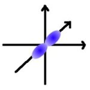

Diese Lerneinheit setzt die Kenntnis folgender Seiten voraus:

<ol>
    <li><a href="bau_der_atome.htm" >Bau der Atome</a>: 
Rutherford: Kern-Hülle-Modell 
Bohr : Schalenmodell (Energiestufen)</li></ol>
<h2>1. Das Orbitalmodell des Atoms</h2>

Energie wird nicht in beliebig großen, sondern nur in ganz bestimmten Portionen oder Energiequanten abgegeben oder aufgenommen.

Die unterschiedlichen Energiestufen des Elektrons werden als Schalen bezeichnet. Jede Schale kann 2n2 Elektronen haben, wobei n für die jeweilige Schale steht.

Als erstes muss das energieärmere Energieniveau voll besetzt werden, bevor Elektronen in ein höheres Energieniveau aufgenommen werden können.

Der Bereich, in dem sich ein Elektron mit einer hohen Wahrscheinlichkeit aufhält wird als Orbital bezeichnet.

Jedes Orbital kann maximal zwei Elektronen aufnehmen. Diese haben entgegengesetzten Spin.

<h3>Das spd-Modell</h3>

Die Energiezustände (Schalen) n &#8805; 2 setzen sich aus mehreren energetisch unterschiedlichen Energieniveaus zusammen.

<h3>Die Nebenquantenzahl l</h3>
<table class="style1"><tbody><tr class="odd"><td style="width:80px">n = 1</td><td class="c1" style="width:120px">l = 0</td><td rowspan="5">Die Nebenquantenzahl l wird meist nicht durch Zahlen, sondern durch die Buchstaben s, p, d und f bezeichnet.</td>
</tr>
<tr>
    <td>n = 2</td><td class="c1">l = 0; 1 (2; 3)</td>
</tr><tr class="odd">
    <td> 
</td><td class="c1">s;p (d; f)</td>
</tr>
<tr>
    <td>n = 3 </td><td class="c1">l = 0; 1; 2 </td>
</tr><tr class="odd">
    <td>n = 4 </td><td class="c1">l = 0; 1; 2; 3</td>
</tr></tbody>
</table>

<table class="style1"><tbody>
<tr><th colspan="2">Orbital</th><th>maximale Elektronenzahl</th>
</tr>
<tr><td class="c1">s (sharp)</td>
    <td>l = 0</td>
    <td>2 </td>
</tr><tr class="odd"><td class="c1">p (principal) </td>
    <td>l = 1 </td>
    <td>6 </td>
</tr>
<tr><td class="c1">d (diffuse)</td>
    <td>l = 2</td>
    <td> 10 </td>
</tr><tr class="odd"><td class="c1"> f (fundamental) </td>
    <td> l = 3 </td>
    <td> 14 </td>
</tr></tbody>
</table>

<h3>Die Magnetquantenzahl m</h3>

Sie beschreibt die räumliche Orientierung der beiden Elektronen.

<table class="style1"><tbody>
<tr>
    <td></td>
    <td></td>
    <td></td>
</tr><tr class="odd">
    <td>px</td>
    <td>py</td>
    <td>pz</td>
</tr>
<tr>
    <td>für l = 2 (p-Orbital) 

m = -1, 0, 1

</td>
    <td>l = 3 (d-Orbital) 
m = -2, -1, 0, 1, 2 </td>
    <td> 
</td>
</tr></tbody>
</table>

Ein Atomorbital wird durch die Angabe der Hauptquantenzahl n, der Nebenquantenzahl l und der Magnetquantenzahl m eindeutig beschrieben.

<h3>Die Spinquantenzahl s</h3>

s = - 0, 5 und s = 0, 5

Die beiden Elektronen eines Orbitales unterscheiden sich durch ihren Spin (Eigenrotation)

<dl><dt>Pauli-Prinzip</dt><dd>Zwei Elektronen eines Atoms können nicht in allen vier Quantenzahlen übereinstimmen.</dd></dl><h2>2. Die Besetzung der Orbitale mit Elektronen</h2>

Die Kästchenschreibweise:

<table class="style1"><tbody>
<tr>
    <td>1s</td>
    <td></td>
    <td>leeres s-Orbital</td>
</tr><tr class="odd">
    <td>1s</td>
    <td></td>
    <td>halb besetztes s-Orbital (einfach besetzt)</td>
</tr>
<tr>
    <td>1s</td>
    <td></td>
    <td>vollbesetztes s-Orbital (doppelt besetzt)</td>
</tr></tbody>
</table>

<h3>Bestimmung des Orbitales</h3>

Regeln für die Besetzung

<ol>
    <li>Aufbauregel 
Orbitale werden in der Reihenfolge zunehmender Orbitalenergie besetzt</li>
    <li>Hund'sche Regel 
Energie gleicher Orbitale (gleiche Haupt- und Nebenquantenzahl) werden zunächst jeweils mit einem Elektron (einfach) besetzt.</li>
    <li>Jedes Orbital kann maximal zwei Elektronen aufnehmen</li></ol>

Die Kästchenschreibweise ist ein Hilfsmittel um chemisches Verhalten verständlich zu machen.

<h3>Die Übergangselemente</h3>

Das höchste Niveau der 3. Energiestufe (3d) ist Energiereicher als das tiefste Niveau der 4. Energiestufe (4s). Übergangselemente sind Elemente mit einem unvollständig oder bei diesem Element erstmals vollbesetztem d-Orbital. Die Voll- oder Halbbesetzung aller d-Orbitale (d10 oder d5) ist energetisch begünstigt und wird daher bevorzugt.

<h2>3. Oxidationszahl und Elektronenkonfiguration</h2>

Bei den Atomen der s und p Elemente liegen die Tendenzen auf totale Leerung oder vollbesetzung des s- und p-Niveaus. Bei den Atomen der 3d-Elemente liegen die Tendenzen auf Totalleerung, Halbbesetzung und Vollbesetzung des 3d-Niveaus.

