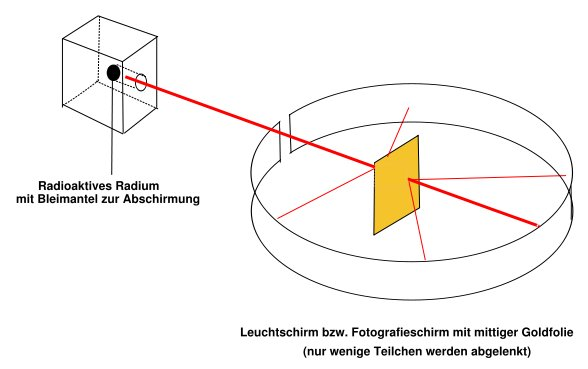
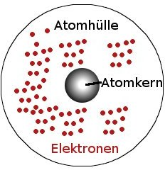
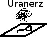
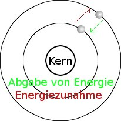
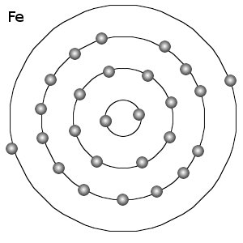

<h1>Bau der Atome</h1>

Demokrit, 400 v. Chr.: kleinste unteilbare Bausteine 
17. Jh. Alle Stoffe enthalten positive und negative Ladungen. 
Die Träger der negativen Ladungen sind Elektronen. 
1909 Der Rutherfordsche Streuversuch

1: &alpha;-Strahler; radioaktives Material 
99, 99% der &alpha;-Teilchen fliegen durch die Folie ohne abgelenkt zu werden!

E:

<table class="style1"><tbody>
<tr><th scope="col">Name</th><th scope="col">Elektron</th><th scope="col">Neutron</th><th scope="col">Proton</th>
</tr>
<tr>
    <td>Ladung (in C)</td>
    <td>-1, 602176462 &sdot; 10-19</td>
    <td>0 </td>
    <td>1, 602176462 &sdot; 10-19</td>
</tr><tr class="odd">
    <td>Symbol</td>
    <td>e-</td>
    <td>n</td>
    <td>e, p, p+</td>
</tr>
<tr>
    <td>Masse (in u)</td>
    <td>1/2000</td>
    <td>1, 008</td>
    <td>1, 007</td>
</tr></tbody>
</table>

&rArr; Das Kern-Hülle-Modell der Atome (= das Rutherford'sche Atommodell)

Atomhülle (&empty; ca. 10-10 m) vgl. Fernsehturm 
(besteht aus Elektronen) 
Atomkern (&empty; ca. 10-15 m) vgl. Stecknadelkopf 
(besteht aus Protonen und Neutronen)

<ol>
    <li>Das Atom besteht aus Atomhülle und Atomkern</li>
    <li>Der Atomkern enthält nahezu die gesamte Masse und ist positiv geladen.</li>
    <li>Die Atomhülle ist nahezu masselos und ist negativ geladen.</li></ol>

Die Anzahl der Elektronen entspricht der Anzahl der Protonen Atome sind elektrisch Neutral.

<h2>Radioaktivität</h2>

Entdeckung: 1896 durch Becquerel

Fotopapier (Reagiert auf Strahlung)

Nach Entwicklung des Fotos.

<table class="style1"><tbody>
<tr><th>Name</th><th>bestehen aus</th><th>v in c</th><th>Reichweite (Luft)</th>
</tr>
<tr>
    <td>&alpha;-Strahlung</td>
    <td> (Heliumatomkern)</td>
    <td>5-10%</td>
    <td class="c1">einige cm</td>
</tr><tr class="odd">
    <td>&beta;-Strahlung</td>
    <td>Elektronen</td>
    <td>98%</td>
    <td class="c1">einige m</td>
</tr>
<tr>
    <td>&gamma;-Strahlung</td>
    <td>Elektromagnetische Welle </td>
    <td>100%</td>
    <td class="c1"> &infin; 
Bleiplatten oder Betonwände können &gamma;-Strahlung abschwächen </td>
</tr></tbody>
</table>

c ist die Lichtgeschwindigkeit und beträgt in Luft ca. 300.000 km/s

Radioaktive Strahlung entsteht beim Zerfall von instabilen Atomkernen. Entscheidend für die Stabilität ist das Verhältnis von Protonen und Neutronen.

PSE 

A = Nukleonenzahl = Anzahl der Neutronen + Anzahl der Protonen 
Z = Kernladungszahl = Anzahl der Protonen = Anzahl der Elektronen = Ordnungszahl

z.B. 

<dl><dd>Elemente sind Stoffe / Atome mit gleicher Protonenzahl.</dd>
<dd>Isotope sind Stoffe / Atome mit gleicher Protonenzahl aber unterschiedlicher Neutronenzahl.</dd></dl>
<h2>Die Atomhülle</h2>

Kern-Hülle-Modell (Rutherford)

FF = Fliehkraft 
FA = Anziehungskraft (elektrostatische Kraft)

Energie der Elektronen in der Hülle

großer Abstand: kleine Anziehungskraft

kleiner Abstand: große Anziehungskraft

Ionisierungsenergie ist die Energie, die zur Abtrennung eines Elektrons vom Atom benötigt wird. Je näher das Elektron am Atomkern ist, desto mehr Ionisierungsenergie wird benötigt.

Atome, die zu viele oder zu wenige Elektronen besitzen nennt man Ionen.

Diskussion:

1. Sind mehr Protonen im Kern, werden die Elektronen stärker angezogen, d.h. &rarr; höhere Ionisierungsenergie.

Atomradius He &lt; H

Ne &lt; L

zwei ungleichmäßige Sprünge

z.B. zur Abspaltung eines Elektrons bei Natrium ist sehr viel weniger Energie notwendig als bei Neon, d.h. dieses Elektron ist viel weiter vom Kern entfernt.

genauso:

<ul>
<li>He &rarr; Li</li>
<li>Ne &rarr; Na</li>
<li>Ar &rarr; K</li>
<li>Kr &rarr; Rb</li>
<li>Xe &rarr; Cs</li>
<li>Rn &rarr; Fr</li>
</ul>

bisher: Atomkern-Hülle-Modell

<dl><dd>Die Elektronen der Atome haben nicht alle die gleichen Energiestufen, d.h. bilden sich Elektronengruppen mit verschiedenen Umlaufbahnen (Schalen)</dd></dl>
<h2>Atommodell von Niels Bohr (1885 - 1962)</h2>

Die Atomhülle ist aus Schalen aufgebaut. Diese enthalten eine bestimmte Anzahl von Elektronen mit gleicher Energie.

Diese Schalen werden von innen nach außen mit der Hauptquantenzahl 1, 2, 3, 4, 5, 6, 7.

Die maximale Anzahl der Elektronen auf einer Schale berechnet man aus 2n2

Einteilung der Elemente im Periodensystem

1869 Mayer / Mendelejew

historisch:

<ul>
    <li>Einteilung der Elemente nach Atommasse (molare Masse)</li>
    <li>Elemente mit ähnlichen Eigenschaften stehen untereinander</li>
</ul>

heute:

<ul>
    <li>nach Anzahl der Protonen im Kern (Ordnungszahl)</li>
    <li>senkrechte Anordnung der Elemente besitzen in der äußeren Schale die gleiche Anzahl an Elektronen (Valenzelektronen: äußere Elektronen)</li>
</ul>

<h2>Material</h2>
<ul>
  <li><a href="http://www.youtube.com/watch?v=-P4N-0Wbtyk">Protonen, Neutronen und Elektronen - Video</a></li>
</ul>

Quellen: 
<a href="http://de.wikibooks.org/wiki/Bild:Atombau_-_Rutherfordscher_Streuversuch.svg">Rutherford'scher Streuversuch</a>

