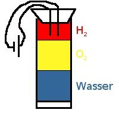

<dl><dt>Gesetz der Erhaltung der Masse</dt><dd>In allen chemischen Reaktionen bleibt die Gesamtmasse gleich!</dd></dl><h2>Gesetz der konstanten Proportionen</h2>

V Simulation mit Lego 
m (Kupferoxid) = 2 
m () = 20, 3 
Reaktion: 
Kupferoxid + Wasserstoff &#8594; Kupfer + Wasser 
+&#8594; 
m(Kupfer) = ? 
m () = 13, 4 g 
&#8658; m (Sauerstoff) = m (Kupferoxid) - m (Kupfer) 
m (O) = 6, 9 g 
Massenverhältnisse: m(Kupfer)/m(O)=1, 9 
Wir wiederholen den Versuch mit einer anderen Masse: 
m (CO) = 13, 5 g 
m (C) = 8, 8 g 
m (O) = 4, 7 g 
m(C) / m(O) = 1, 9

<dl><dt>Gesetz der konstanten Proportionen:</dt><dd>Das Massenverhältnis der Elemente in einer chemischen Verbindung ist konstant, d.h. Verbindungen besitzen konstante chemische Zusammensetzungen.</dd></dl><h2>Gesetz der multiplen Proportionen:</h2>

Kupferoxid kann schwarz oder rot sein! 
&#8658; es gibt verschiedene Verbindungen von Kupfer und Sauerstoff (hier: 2) 
Simulation mit Lego: 
Rotes Kupferoxid (Cu2O)nach der Reaktion: 
m () = 11, 2 gm ()= 8, 8 g m(Cu)/m(O)=3, 7

<dl><dt>Gesetz der multiplen Proportionen:</dt><dd>Bilden zwei Elemente verschiedene Verbindungen miteinander, so stehen die Massen eines Elements, die sich mit einer gegebenen Masse des anderen Elements verbinden, im Verhältnis kleiner ganzer Zahlen.</dd></dl><cite>Dalton (1766 - 1844): Atomhypothese</cite><blockquote class="style1"><ol>
    <li>Materie besteht aus kleinsten kugelförmigen Teilchen oder Atomen.</li>
    <li>Diese Atome sind unteilbar und können weder geschaffen noch zerstört werden.</li>
    <li>Alle Atome eines chemischen Elements sind untereinander gleich. Atome unterscheiden sich nur in der Masse von Atomen anderer Elemente.</li>
    <li>Diese Atome können chemische Bindungen eingehen und aus diesen auch wieder gelöst werden.</li>
    <li>Das Teilchen einer Verbindung wird aus einer bestimmten, stets gleichen Anzahl von Atomen der Elemente gebildet, aus denen die Verbindung besteht.</li></ol></blockquote><h2>Volumenverhältnisse bei chemischen Reaktionen mit Gasen</h2>

Eudiometerversuche 
&#8594; Zündung 
z.B. Sauerstoff (g.) + Wasserstoff (g.) &#8594; Wasser (fl.) 
Restgas? 
&#8594; Volumenverhältnisse der Gase reagieren miteinander 
O2 + 4 H &#8594; 2H2O 
Cl + H &#8594; ClH

<dl><dt>Volumengesetz von Gay-Lussac:</dt><dd>Gase reagieren bei konstanter Temperatur und konstantem Druck stets miteinander in ganzzahligen Volumenverhältnissen.</dd><dt>Avogadro:</dt><dd>Gleiche Gasvolumina enthalten unter gleichen Bedingungen (Druck und Temperatur) die gleiche Anzahl von Gasteilchen.</dd></dl>

Viele Gase bestehen aus Molekülen. 
Ausnahmen: Edelgase bestehen aus Atomen. 
z.B.:

<ul>
    <li>Sauerstoffgas O2</li>
    <li>Wasserstoffgas H2</li>
    <li>Chlorgas Cl2</li>
    <li>2 Sauerstoffmoleküle: 2 O2</li>
</ul>

g: gasförmig 
l: flüssig 
s: fest

Anwendung der Gasgesetze: 
1)O2 (g) + 2H2 (g) &#8594; 2 H2O (g)

 + &#8594;

2) Cl2 (g) + H2 (g) &#8594; 2 HCl (g)

Masse von Atomen 
Welche Masse hat ein Wasserstoffatom? 
&#8658; Periodensystem 
m (H) = 1, 0079 u

<dl><dd>1u=(1/12) &#8901; m(12C) &#8776; 1m(H)</dd></dl>

1 u = 1 g/L = 1, 660565 &#8901; 10-24 g/u 
m(H) = 1, 0079 &#8901; 1u = 1, 6736834g &#8901; 10-24 &#8776; 1, 6737g &#8901; 10-24 
3, 739 &#8901; 10-25 g in u

Masse von Molekülen: 
z.B.: Wasserstoffgas: H2 
m(H2) = 2 &#8901; m(H)=2, 0158u 
m(H2O) = 2 &#8901; m(H) + m(O) =18, 0152u=2, 991541&#8901; 10-23g 
m(C6H12O6) = 180, 1572u = 2, 99163 &#8901; 10-22 g

