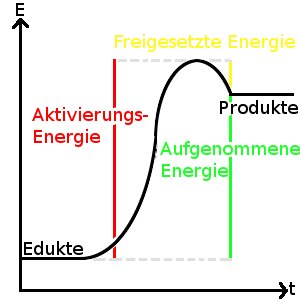
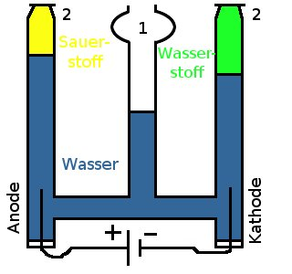

<h2>Reaktionstypen</h2>
<h3>1. Synthese</h3>

V 0, 5 g S + 1 g Fe: Vermischt, das Gemenge wird erhitzt 
B Das Gemenge glüht auf, wird schwarz. Es entstehen blaue Flammen (Schwefel verbrennt). Es entsteht ein schwarzer Feststoff.

E Schwefelpulver (S) + Eisenpulver (Fe) &#8594; Eisensulfid (FeS) 
A + B &#8594; AB

<dl><dd>Die Bildung neuer Stoffe aus mehreren anderen nennt man Synthese</dd><dd>Dabei entsteht eine Verbindung, also ein Reinstoff, der aus mehreren Bestandteilen aufgebaut ist.</dd></dl>

V ca. 5 ml Wasserstoffperoxyd (H2O2) werden erhitzt 
B Es bilden sich Gasblässchen.

E Wasserstoffperoxyd &#8594; Wasserstoff + Sauerstoffgas

<h3>2. Analyse</h3>
<dl><dd>Die Zerlegung eines Stoffes nennt man Analyse.</dd></dl><h3>3. Umsetzung</h3>
<dl><dd>Treten Zerlegung und Bildung von Stoffen gleichzeitig auf, so spricht man von einer Umsetzung: 
AB + CD &#8594; AC + BD</dd></dl>

V Salzsäure (HCl) + Eisensulfid (FeS)

<h2>Energiebeteiligung bei chemischen Reaktionen</h2>
<dl><dd>Energie ist bei allen chemischen Reaktionen beteiligt.</dd></dl>

V 2 Zn (Zinkpulver) + 1 S (Schwefelpulver) wird erhitzt 
B 2 Zn + 1 S &#8594; Zn2S 
Es ändert sich die Farbe, ein Zischen ist zu hören, eine Flamme ist zu sehen. 
E Zink + Schwefel &#8594; Zinksulfid

V Ammoniumthiocyanat + Bariumhydroxid 
Orange, fest Weiß, glänzend, fest 
B Das Gemenge wird flüssig, Temperatur sinkt, Gasentwicklung 
E Ammoniumthiocyanat + Bariumhydroxid &#8594;Bariumthiocyanat + Ammoniak + Wasser 
CH4N2S+BaOH2 &#8594; CHSNBa+NH3+ H2O

<dl><dd>Reaktionen bei denen Wärme abgegeben wird nennt man exotherme Reaktionen.</dd><dd>Reaktionen bei denen wärme aufgenommen wird nennt man endotherme Reaktionen.</dd></dl><h2>Kennzeichen chemischer Reaktionen</h2>
<ul>
    <li>Jede chemische Reaktion ist mit einer Energieumwandlung verbunden</li>
    <li>Jede chemische Reaktion ist mit einer Stoffumwandlung verbunden</li>
    <li>Es wird eine Aktivierungsenergie zum Start benötigt</li>
</ul>

Energieformen:

<ul>
    <li>Licht</li>
    <li>Wärme (Bewegung von Teilchen)</li>
    <li>Innere Energie (chemische Energie)</li>
    <li>Elektrische Energie</li>
    <li>Mechanische Energie (kinetische Energie)</li>
    <li>Lageenergie (Potentielle Energie)</li>
</ul>

<h2>Zersetzung von Wasser: Elektrolyse</h2>

(= Zerlegung von Stoffen mit Hilfe von elektrischer Energie)

VHoffmanscher Zersetzungsapparat

1: Vorratsbehälter 
2: Hahn

B An den Elektroden entstehen Gasblasen die aufsteigen 
E Nachweisreaktion der Produkte

Test für Sauerstoffgas: die Glimmspanprobe 
Man hält den glühenden Holzstab in das zu testende Gas! 
Beobachtung bei Sauerstoff: der Holzstab glüht auf 
kein Sauerstoff: keine Reaktion 
hier: Gas der Anode: glüht auf &#8594; Sauerstoffgas 
der Kathode: keine Veränderung

Identifikation von Wasserstoffgas: Die Knallgasprobe 
V Man füllt das Testgas in ein Reagenzglas und hält die Öffnung in eine Flamme. 
B Wasserstoff vorhanden (positiver Nachweis): Man hört ein pfeifendes oder ploppendes Geräusch 
Wasserstoff nicht vorhanden (negativer Nachweis): keine Reaktion 
2 H2O (elektrische Energie) &#8594; 2H2 + O2

<dl><dd>Es gibt Stoffe, die mit chemischen Reaktionen (Analysen) nicht weiter in verschiedene Bestandteile zerlegt werden können. Solche Stoffe nennt man Elemente</dd></dl><table style="text-align: center;" border="1" summary="Aufteilung der Stoffe in Gemische, Reinstoffe sowie nach homogen und heterogen"><tbody>
<tr><td colspan="6">Stoff </td>
</tr>
<tr><td colspan="2">Gemisch</td><td colspan="4">Reinstoff</td>
</tr>
<tr>
    <td>heterogen </td>
    <td>homogen</td>
    <td>Elemente</td><td colspan="3"> Verbindungen </td>
</tr>
<tr>
    <td>- Phasen</td>
    <td>- Phasen</td>
    <td> </td>
    <td>Nicht- 
Metalle</td>
    <td>Halb- 
Metalle</td>
    <td>Metalle</td>
</tr></tbody>
</table>

<table summary="Die wichtigsten chemischen Elemente im Überblick" class="style1"><caption>Wichtige Elemente</caption><tbody>
<tr><th scope="col">Name</th><th scope="col">chemisches Symbol</th><th scope="col">Metall / Nichtmetall</th><th scope="col">Siedepunkt (in °C)</th>
</tr>
<tr><td class="c1">Sauerstoff</td>
    <td>O</td>
    <td>Nichtmetall</td>
    <td>-183</td>
</tr><tr class="odd"><td class="c1">Eisen</td>
    <td>Fe</td>
    <td>Metall</td>
    <td>2750</td>
</tr>
<tr><td class="c1">Aluminium</td>
    <td>Al</td>
    <td>Metall</td>
    <td>2467</td>
</tr><tr class="odd"><td class="c1">Kupfer</td>
    <td>Cu</td>
    <td>Metall</td>
    <td>2567</td>
</tr>
<tr><td class="c1">Kohlenstoff</td>
    <td>C</td>
    <td>Nichtmetall</td>
    <td>4827</td>
</tr><tr class="odd"><td class="c1">Magnesium</td>
    <td>Mg</td>
    <td>Metall</td>
    <td>1107</td>
</tr>
<tr><td class="c1">Chlor</td>
    <td>Cl</td>
    <td>Nichtmetall</td>
    <td>-35</td>
</tr><tr class="odd"><td class="c1">Wasserstoff</td>
    <td>H</td>
    <td>Nichtmetall</td>
    <td>-253</td>
</tr>
<tr><td class="c1">Stickstoff</td>
    <td>N</td>
    <td>Nichtmetall</td>
    <td>-194</td>
</tr><tr class="odd"><td class="c1">Schwefel</td>
    <td>S</td>
    <td>Nichtmetall</td>
    <td>445</td>
</tr></tbody>
</table>

<h2>Material</h2>
<ul>
    <li><a href="http://www.youtube.com/watch?v=tE4668aarck">Video der chemischen Reaktionen</a></li>
    <li><a href="http://www.youtube.com/watch?v=VbIaK6PLrRM">Aktivierungsenergie</a></li>
    <li><a href="http://www.youtube.com/watch?v=-X8KPcLjgPY">Die Knallgasprobe - Video</a></li>
    <li><a href="doc/chemische_reaktion.pdf">Die chemische Reaktion</a></li>
</ul>
