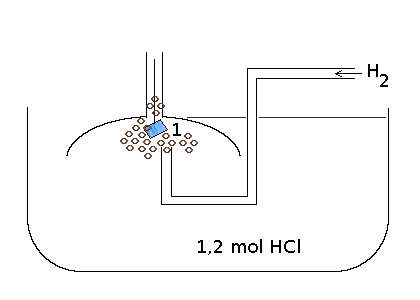
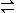

Diese Lerneinheit setzt die Kenntnis folgender Seiten voraus:

<ol>
    <li><a href="redoxgleichung_erstellen.htm" >Erstellen einer Redoxgleichung</a></li></ol>
<h2>1. Analogien zwischen Redoxreaktionen und Protolysereaktionen </h2>

&#8594; siehe Kopie

<h2>2. Allgemeines zu Redoxreaktionen</h2>
<dl><dt>Redoxreaktion</dt><dd>Die Redoxreaktion ist ein Elektronenübergang (Elektronentransfer) von Elektronendonator (Reduktionsmittel) auf den Elektronenakzeptor (Oxidationsmittel).</dd></dl>

Allgemein:

Reduktion: OM1 + e- &#8594; RM1 (Oxidationsmittel wird reduziert.) 
Oxidation: RM2 &#8594; OM2 + e- (Reduktionsmittel wird oxidiert.) 
Redox: OM1 + RM2 &#8594; RM1 + OM2

<dl><dt>Reduktion</dt><dd>Elektronenaufnahme: Das Oxidationsmittel nimmt Elektronen auf &#8658; Erniedrigung der Oxidationszahl</dd><dt>Oxidation</dt><dd>Elektronenabgabe: Das Reduktionsmittel gibt Elektronen ab &#8658; Erhöhung der Oxidationszahl</dd><dt>Oxidationszahl</dt><dd>Die Oxidationszahl ist eine formale Hilfsgröße zum Aufstellen von Redoxgleichungen. Sie stellt eine fiktive Ladung von Atomen in Molekülen dar, wenn bindende Elektronenpaare den Elektronegativeren Bindungspartner zugeschlagen werden.</dd></dl><h2>3. Wiederholende Übung zum Aufstellen von Redoxgleichungen</h2>

Bsp.: Im alkalischen reagieren Sulfit und Permanganat zu Sulfat und Braunstein.

Sulfit : SO32- 
Permanganat: MnO4- 
Sulfat : SO4- 
Braunstein : MnO2 
SO32- + MnO4- &#8594; SO42- + MnO2

Oxidation: 2 SO32- + O2 &#8594; SO42- + MnO2 
Reduktion: 2 MnO4- &#8594; 2 MnO2 + OH-

<ol>
    <li>Bestimmung der Oxidationszahlen</li>
    <li>Oxidation / Reduktion (Aufnahme von Elektronen: Reduktion)</li>
    <li>Ladungsausgleich (OH-)</li>
    <li>Stoffausgleich (H2O)</li></ol><table class="style1"><tbody>
<tr><th>Oxidation</th><th>Reduktion</th>
</tr>
<tr>
    <td>3 SO32- + 2 OH- &#8594; SO42- + 2 e- + H2O</td>
    <td>MnO4- + 3 e- + 2 H2O &#8594; MnO2 + 4OH-</td>
</tr></tbody>
</table>

3 SO32- + 2 MnO4- + H2O &#8594; 3 SO42- + 2 MnO2 + 2 OH-

Oxidation: 3 SO32- + 2 OH- &#8594; SO42- + 2 e- + H2O 
Reduktion: MnO4- + 3 e- + 2 H2O &#8594; MnO2 + 4OH- 
Redox: 3 SO32- + 2 MnO4- + H2O &#8594; 3 SO42- + 2 OH -

<h2>4. Redoxreihe der Metalle</h2>
<table class="style1"><tbody>
<tr><th></th><th>Zn2+</th><th>Fe3+</th><th>Cu2+</th><th>Ag+</th>
</tr>
<tr><th>Zn</th><td style="background-color:#000;"></td>
    <td>+ (1)</td>
    <td>+</td>
    <td>+</td>
</tr>
<tr><th>Fe</th>
    <td>-</td><td style="background-color:#000;"></td>
    <td>+ (2)</td>
    <td>+</td>
</tr>
<tr><th>Cu</th>
    <td>-</td>
    <td>-</td><td style="background-color:#000;"></td>
    <td>+ (3)</td>
</tr>
<tr><th>Ag</th>
    <td>-</td>
    <td>-</td>
    <td>-</td><td style="background-color:#000;"></td>
</tr></tbody>
</table>

1)  
2)  
3) 

<table class="style1"><tbody>
<tr>
    <td>

Reduktionsvermögen nimmt zu

(Bestreben e- abzugeben)

</td>
    <td>

Zn (unedle Metalle)

Fe

Cu

Ag (edle Metalle)

</td>
</tr>
<tr>
    <td>

Oxidationsvermögen nimmt zu

</td>
    <td>Ag+ 
Cu2+ 
Fe3+ 
Zn+ 
</td>
</tr></tbody>
</table>

Oxidation: SO3- + 2 OH- &#8594; SO4- + H2O + 2 e-

Reduktion: MnO4- + 3 e- + 2 H2O &#8594; MnO2 + 4 OH-

Redox: 

<h2>5. Lösungs- und Abscheidungsdruck</h2>

V

Kein galvanisches Element!

B Es ist eine Spannung messbar (ca. 0, 005 V)

A

a) Cu2+ + 2 e- &#8594; Cu 
b) Cu &#8594; Cu2+ + 2 e-

<dl><dt>Abscheidungsdruck</dt><dd>Tendenz der Metallkationen (z.B. Cu2+) sich an der Elektrode unter Elektronenaufnahme abzuscheiden.</dd><dt>Lösungsdruck</dt><dd>Das Bestreben von Metallatomen (z.B. Cu) unter Elektronenabgabe in Lösung zu gehen.</dd></dl><h2>6. Galvanische Elemente bzw. Zellen</h2>

a) Das Daniell-Element

0, 8 V

Salzbrücke: Ionenaustausch (Zn2+, Cu2+, OH-, ...)

Gemessene Spannung unter optimalen Bedingungen: 1, 1 V

Im Daniell-Element sind Kuper-Halbzellen elektrolytisch und elektrisch miteinander verbunden. Eine Halbzelle kann aus einem Metall und der Lösung seines Salzes bestehen.

<dl><dt>Galvanisches Element</dt><dd>Zwei Halbzellen elektrisch und elektrolytisch miteinander verbunden</dd></dl>

Oxidation: Zn &#8594; Zn2+ + 2 e- 
Reduktion: Cu2+ + 2 e- &#8594; Cu 
Redox: Zn + Cu2+ &#8594; Zn2+ + Cu

Je weiter die Elemente voneinander entfernt sind, desto höher ist die Spannung.

Blei-Akku: leicht zu handhaben

Galvanische Elemente entsprechen in ihrem prinzipiellem Aufbau dem einer Batterie. Durch Kombination zweier Halbzellen mit entsprechenden Spannungsunterschied ist es möglich chemische Energie in Elektrische Energie umzuwandeln. Dabei wird die unedlere Elektrode verbraucht und die Konzentration der Salzlösung der anderen Elektrode nimmt ab.

Bsp.: Cu / Zn

<table class="style1"><tbody>
<tr><th>Kurzschreibweise für galvanische Elemente:</th><th>Normale Schreibweise</th>
</tr>
<tr>
    <td>Zn / Zn2+|| Cu2+/ Cu</td>
    <td>

Oxidation: Zn &#8594; Zn2+ + 2 e-

Reduktion: Cu2+ + 2 e- &#8594; Cu

</td>
</tr></tbody>
</table>

Übungsbeispiele:

a) Fe / Cu; b) Zn / Ag; c) Ag / Cu

<table class="style1"><tbody>
<tr>
    <td>a)</td>
    <td>Fe / Fe3+|| Cu2+/ Cu</td>
    <td>Oxidation: Fe &#8594; Fe3+ + 3 e- 
Reduktion: Cu2+ + 2 e- &#8594; Cu</td>
</tr>
<tr>
    <td>b) 
1, 5 V</td>
    <td>Zn / Zn2+|| Ag+/ Ag</td>
    <td>

Oxidation: Zn &#8594; Zn2+ + 2 e-

Reduktion: Ag+ + e- &#8594; Ag

</td>
</tr>
<tr>
    <td>c)</td>
    <td>Cu / Cu2+|| Ag+/ Ag</td>
    <td>

Oxidation: Cu &#8594; Cu2+ + 2 e-

Reduktion: Ag+ + e- &#8594; Ag

</td>
</tr></tbody>
</table>

<h2>7. Die Standardwasserstoffelektrode (SHE)</h2>

1: platinierte Platinelektrode

(poröse Oberfläche)

Die SHE ist eine galvanische Halbzelle, die aus einer platinierten Platinelektrode besteht, die in eine 1, 2 molare HCl-Lösung (pH = 0) und von Wasserstoff bei Normaldruck umspült wird. Sie ist Bezugselektrode zur Festlegung vom Standardpotential E0 beliebiger Redoxsysteme.

Redoxpotential: Bestreben eines Metalls unter Elektronenabgabe in den Kationenzustand überzugehen.

<h2>8. Das Standardpotential (E0)</h2>
<table class="style1"><tbody>
<tr>
    <td> 0, 80 V:  
0, 34 V:  
0, 00 V:  
-0, 41V:  
-0, 74V: </td>
    <td>

Die Spannung, die eine galvanische Halbzelle unter Standardbedingungen gegenüber der SHE aufweist heißt Standardpotential E0. Dieses wird in Volt gemessen.

</td>
</tr></tbody>
</table>

und die korrespondierende Indikatorbase ??????? sie in ihrer Farbe.

Der Farbumschlag wird durch eine Protolysereaktion verursacht.

<h4>b) Bestimmung des Umschlagspunktes / Umschlagsbereichs</h4>

Am Umschlagspunkt liegt eine Mischfarbe und gleiche Mengen an Indikatorsäure und Indikatorbase vor.

Am Umschlagspunkt:

c(HInd) = c(Ind-) 
MWG(ks) = c(Ind-) &#8901; c(H3O+) / (c(HInd) &#8901; c(H2O)) = c(Ind-) &#8901; c(H3O+) / c(HInd) 
ks = c(H3O+) 
pks = pH

Der Umschlagspunkt lieg etwa bei pks ± 1

Die reinen Indikatorfarben von HInd bzw Ind- treffen erst bei 10-facher Konzentration der jeweiligen Form auf.

pk ± 1 = pH

Übungsaufgaben zur Berechnung des pH-Wertes

A1: Berechne den pH-Wert von einer Salzsäurelösung mit c(HCl) = 1, 5 l mol /l

pH = -c(HCl) = -0, 18, da c(H3O+) = c(HCl)

A2:Berechne den pH-Wert folgender Lösungen:

Essigsäure-Lösung: c0 = 0, 25 mol/l

Ammoniak-Lösung: c0 = 7, 4 &#8901; 10-4 mol/l

pH = 10, 1

Berechne die Masse der Säurestoffportion, die in jeweils 125 ml Säurelösung mit pH = 3, 5 enthalten sein muss (Salzsäure).

Geg.: V = 125 ml; pH = 3, 5

Ges.: m(HCl)

M = m / V

c = n / V 
HCl + H2O  H3O+ + Cl

Stoffmengenverhältnis:

1 mol + 1 mol  1 mol + 1 mol

Geg.: c(Säure1) + Stoffmenge Säure2

Ges.: &#916;pH

Säure1 ist schwach &#8594; &#916;pH = pksSäure1 - lg &#8901; (c(Säure2)+c(Säure1)/(c(Säure1) - c(Säure2)))

Geg.: pks(Säure1), c(Säure1), c(Säure2)

Ges.: pH

<h2>9. Die elektrische Spannungsquelle</h2>
<h3>a) Standardpotentiale (E0) Metallhalbzellen</h3>

Ordnet man alle Redoxpaare nach ihren Standardpotential, so erhält man die <a href="doc/Chemie_Worksheet.pdf">elektrochemische Spannungsreihe</a> 
Allgemein gilt: Das in der Spannungsreihe tiefer stehende Reduktionsmittel reduziert das höher stehende Oxidationsmittel

<dl><dt>Leerlaufspannung</dt><dd>Die Differenz zwischen den Redoxpotentialen zweier Halbzellen ergibt bei stromloser Messung die Leerlaufspannung. Bei Standardbedingungen ist sie gleich der Differenz der Standardpotentiale</dd></dl>

Berechnung der Leerlaufspannung:

U2 = &#916;E0 = E0Kathode - E0Anode

Bsp.: Zn / Zn2+ // Cu2+ / Cu : 1, 1 V 
Anode // Kathode

Merkhilfe:Kathodische Reduktion - Anodische Oxidation 
Konsonanten - Vokale

Redoxreaktionen in Galvanischen Elementen laufen nur dann freiwillig ab, wenn &#916;E0 > 0 ist.

<h3>Standardpotentiale bei Nichtmetallen</h3>

Jedem Redoxpaar, auch Nichtmetallen und deren Verbindungen, lässt sich ein Standardpotential zuordnen.

E0(F- / F2) = + 2, 87 V (stärkstes Oxidationsmittel) 
E0(S2- / S) = - 0, 5 V 
E0(SO4-/ SO4) = - 0, 92 V

Anhand der Potentialdifferenz &#916;E0 zwischen Kathodischer Reduktion und Anodischer Oxidation lässt sich voraussagen, ob die entsprechende Redoxreaktion ablaufen kann oder nicht.

<dl><dd>&#916;E0 > 0</dd></dl>

&#8594; Das Potential einer Halbzelle ist abhängig von der Konzentration der Salzlösung. Je niedriger die Konzentration, desto höher der Lösungsdruck und desto niedriger das Potential. Daraus ergibt sich ein sog. Konzentrationselement. 
Ein Galvanisches Element aus zwei Halbzellen, das aus den gleichen Redoxpaaren aber unterschiedlichen Elektrolytkonzentrationen besteht nennt man Konzentrationselement.

Zelle mit höherer Konzentration: Kathode (Reduktion) 
Zelle mit niedrigerer Konzentration: Anode (Oxidation)

<h2>11. Die Nernst-Gleichung</h2>

Bsp.: Ag / Ag+ // Ag+ / Ag 
Ag+ + e- &#8594; Ag : Kathode 
Ag &#8594; Ag+ + e-: Anode

<table class="style1">
<tr><th>c1(Ag+)</th><th>c2(Ag+) in mol / l</th><th>c1 / c2</th><th>lg(c1 / c2)</th><th>U2 [in V]</th>
</tr>
<tr>
    <td>1</td>
    <td>1</td>
    <td>1</td>
    <td>0</td>
    <td>0</td>
</tr><tr class="odd">
    <td>1</td>
    <td>0, 1</td>
    <td>10</td>
    <td>1</td>
    <td>0, 059</td>
</tr>
<tr>
    <td>1</td>
    <td>0, 01</td>
    <td>100</td>
    <td>2</td>
    <td>0, 118</td>
</tr><tr class="odd">
    <td>1</td>
    <td>0, 001</td>
    <td>1000</td>
    <td>3</td>
    <td>0, 177</td>
</tr>
</table>

UL = &#916;E0 (Ag / Ag+)= 0, 059 V / n &#8901; lg(c1 / c2) 
n: Anzahl der übertragenen Elektronen 
UL = &#916;E0 (M / Mn+)= 0, 059 V / n &#8901; lg(c1 / c2): UL für ein beliebiges Metall-Konzentrationselement

 Fehlender Teil <h2>12. Elektrochemische Stromerzeugung</h2>
<h3>a) Primärelemente</h3>

&#8594; Primärelemente sind galvanische Elemente, die der Stromerzeugung dienen und nicht wiederaufladbar sind

<ul>
    <li>Zink / Kohle - Batterie</li>
    <li><a href="http://de.wikipedia.org/wiki/Zink-Braunstein-Zelle">Leclanché-Element</a> (Trockenbatterie; Taschenlampenbatterien)</li>
</ul>

Anode: Zn &#8594; Zn2+ + 2 e- 
Kathode: 2 H3O+ + 2 e- + 2 MnO2 &#8594; 3 H2O + Mn2O3 
Elektrolyt: NH4Cl + H2O  NH3 + Cl- + H3O+

Funktion des Elektrolyt:

<ul>
    <li>Ladungsausgleich</li>
    <li>Lieferant für H3O+-Ionen</li>
    <li>Fixierung der Zn2+-Ionen: [Zn(NH3)2]Cl2</li>
</ul>

<h3>b) Sekundär-Element</h3>

&#8594; Sekundär-Elemente sind Galvanische Zellen, die der Stromerzeugung dienen und wiederaufladbar sind (Akkus)

<ul>
    <li>Anwendung:

<ul>
    <li>Autobatterie</li>
    <li>Notstromaggregat</li>
</ul>

</li>
    <li>Vorteile: Hoher Wirkungsgrad und Wiederaufladbar</li>
    <li>Nachteile: Sehr schwer, Blei (giftig), Elektrolyse &#8594; Wasserstoff (Explosion)</li>
</ul>

<h3>Der Bleiakku-Bau</h3>

Sekundäres Galvanisches Element &#8594; wiederaufladbar 
Pb (0) - PbO (II) - PbO2 (IV)

Laden: Mit Gleichstrom (PbSO4 ist nicht mal in H2SO4 löslich!)

Kathode: Pb + SO42- PbSO4 + 2 e- 
Anode: PbSO4 + 5 H2O  PbO2 + HSO4- + 3 H3O+ + 2 e- 
Anode: PbSO4 + 6 H2O  PbO2 + SO42- + 4 H3O+ + 2 e- 
Kathode: PbSO4 + 2 e- Pb + SO42- 
Anode: 2 PbSO4 + 6 H2O  Pb + PbO6 + H3O+ + 2 SO42- (Hinreaktion: Landen; Rückreaktion: Entladen)

<h2>13. Die Elektrolyse</h2>

V CuCl2-Elektrolyse

Oxidation: 2 Cl- &#8594; Cl2 + 2 e- 
Reduktion: Cu2+ + 2 e- &#8594; Cu 
Redox: 2 Cl- + Cu2+ &#8594; Cl2 + Cu+

Als Elektrolysen bezeichnet man Redoxreaktionen, die durch die Zufuhr elektrischer Energie erzwungen werden. Sie stellen eine Umkehrung der freiwilligen Reaktionen in einer Galvanischen Zelle dar.

<h3>Polarisationsprinzip</h3>

UZ = Zersetzungsspannung (&#8594; Mindestspannung ab der eine merkliche Zersetzung eintritt) 
UP = Polarisationsspannung (ist Leerlaufspannung entgegengesetzt) 
UP = UL (falls UL der Elektrolyse = Spannung des Galvanischen Elements) 
UL > UP 
UL = Leerlaufspannung 
UP = Spannung des Galvanischen Elements 
UZ - UP= UÜ (UÜ: Überspannung, Materialabhängig)

Der Spannungsbetrag der Zersetzungsspannung UZ gegenüber der Polarisationsspannung UP nennt sich Überspannung UÜ. 
Dieser ist vor allem bei gasförmigen Produkten abhängig von:

<ul>
    <li>Elektrodenmaterial</li>
    <li>Ionenkonzentration</li>
    <li>Temperatur</li>
    <li>Konzentration</li>
</ul>

<h3>Reihenfolge der Ionenentladung</h3>

Liegen in einer wässrigen Lösung mehrere Ionenarten vor, so werden diejenigen zuerst Entladen, die Betragsmäßig das kleinste Potential besitzen.

Vorgehensweise

<ul>
    <li>Welche Ionen sind in der Lösung?</li>
    <li>Welche Stoffe werden oxidiert, welche reduziert?</li>
    <li>Welche Potentiale haben Redoxpaare</li>
</ul>

<h3>Anwendung der Elektrolyse</h3>

Aluminiumherstellung: 2 Al2O3 &#8594; 4 Al + 3 O2 
Al2O3: Schmelzpunkt 2045 °C; Absenkung des Schmelzpunktes durch Kryolith: Na3AlF6 auf &#8776; 900 °C 
Merksatz: "Na ihr 3, Alf kommt um 6"

<h2>Material</h2>
<ul>
    <li><a href="doc/elektrochemie-aufgaben.pdf">Aufgaben</a></li>
    <li><a href="http://www.youtube.com/watch?v=A0VUsoeT9aM">Die galvanische Zelle - Video</a></li>
    <li><a href="http://www.youtube.com/watch?v=Kj3o0XvhVqQ">Polarität und Elektronegativität - Video</a></li>
    <li><a href="http://www.youtube.com/watch?v=93G_FqpGFGY">Elektronegativität im PSE - Video</a></li>
</ul>

<h2>Siehe auch</h2>
<ul>
    <li><a href="brennstoffzelle.htm">Die Brennstoffzelle</a></li>
</ul>

Quellen: 
<a href="http://de.wikipedia.org/wiki/Bild:Daniell-Element.jpg">Wiki: Daniell-Element</a> 
<a href="http://de.wikipedia.org/wiki/Bleiakku">Wiki: Bleiakkumulator</a> 

