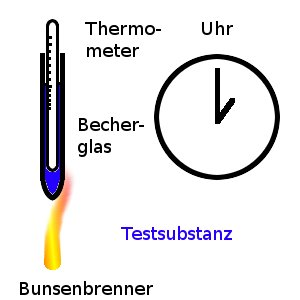
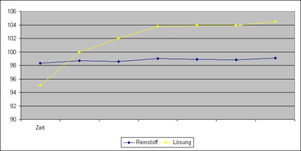
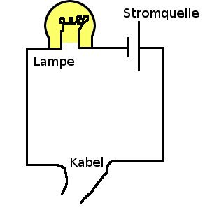

<dl><dt>Stoff (chem.)</dt><dd>jede Form von Materie</dd></dl>

Stoffe im Alltag: z.B. Duschgel, Tütensuppen, Mineralwasser, Waschmittel, Benzin ... 
&#8658; Wir verwenden im Alltag meist Gemische!

<h2>Typen von Gemischen</h2>

Wichtig zur Einteilung:

<ul>
    <li>Aggregatzustand / Phase</li>
    <li>Die Erkennbarkeit des Gemisches mit dem bloßen Auge 
&#8594; ja, erkennbar: heterogenes Gemisch 
&#8594; nein, einheitlich: homogenes Gemisch</li>
</ul>

<table class="style1" summary="Tabelle mit Phasen und Beispielen"><tbody>
<tr><th>Phasen</th><th>heterogen</th><th>homogen</th>
</tr>
<tr><th>fest / fest</th><td class="c1">Beton, Granit 
&#8594; Gemenge</td><td class="c1">Schmuck 
&#8594; Legierung</td>
</tr><tr class="odd"><th>fest / flüssig</th><td class="c1">Peeling, Schlammwasser 
&#8594; Suspension</td><td class="c1">Mineralwasser 
&#8594; Lösung</td>
</tr>
<tr><th>fest / gasförmig</th><td class="c1">Rauch 
&#8594; Rauch</td><td class="c1">(Styropor)</td>
</tr><tr class="odd"><th>flüssig / flüssig</th><td class="c1">Milch, Öl-Wasser 
&#8594; Emulsion</td><td class="c1">Wein, Alkohol-Wasser 
&#8594; Lösung</td>
</tr>
<tr><th>flüssig / gasförmig</th><td class="c1">&#8594; Schaum, Nebel</td><td class="c1">Mineralwasser 
&#8594; Lösung</td>
</tr><tr class="odd"><th>gasförmig / gasförmig</th>
    <td>
-

</td><td class="c1">Luft 
&#8594; Gasgemisch</td>
</tr></tbody>
</table>

<h2>Kenneigenschaften von Reinstoffen</h2>

Wie erkennt man einen Reinstoff?

z.B. durch Bestimmung der Siedetemperatur

V Wir erhitzen Stoffe und messen die Temperatur

Skizze:

<table border="1" summary="Testergebnisse mit Temperaturen"><tbody>
<tr>
    <td>&#977; in C° 
(Stoff 1)</td>
    <td>98, 3</td>
    <td>98, 7</td>
    <td>98, 6</td>
    <td>99</td>
    <td>98, 9</td>
    <td>98, 8</td>
    <td>99, 1</td>
</tr>
<tr>
    <td>&#977; in C° 
(Stoff 2)</td>
    <td>95</td>
    <td>100</td>
    <td>102</td>
    <td>103, 8</td>
    <td>103, 9</td>
    <td>103, 9</td>
    <td>104, 5</td>
</tr></tbody>
</table>

Reinstoffe (hier Wasser) sieden nur bei einer konstanten Temperatur!

Bei Gemischen steigt die Siedetemperatur stetig.

<dl><dd>Nur ein Reinstoff besitzt stets gleich bleibende (= konstante) Eigenschaften, die zu seiner eindeutigen Charakterisierung dienen können. Er unterscheidet sich darin von anderen Reinstoffen.</dd></dl>

<ul>
    <li>Siedepunkt z.B. H2O: 100 °C</li>
    <li>Dichte z.B. &#961;(Al)=2, 7 g / cm3</li>
    <li>Kristallform z.B. Gips bildet nudelförmige Kristalle (vgl. Kunst) 
Kochsalz bildet würfelförmige Kristalle</li>
    <li>Elektrische Leitfähigkeit</li>
</ul>

VLeitfähigkeitsmessgerät

<table border="1" summary="Welche Stoffe leiten Strom"><tbody>
<tr>
    <td>Pb</td>
    <td>ja</td><td rowspan="6"></td>
</tr>
<tr>
    <td>Al</td>
    <td>ja</td>
</tr>
<tr>
    <td>Cn</td>
    <td>ja</td>
</tr>
<tr>
    <td>Holz</td>
    <td>nein</td>
</tr>
<tr>
    <td>PE</td>
    <td>nein</td>
</tr>
<tr>
    <td>Wasser</td>
    <td>nein</td>
</tr></tbody>
</table>

<table style="text-align: center;" width="90%" border="1" summary="Einteilung der Stoffe nach Eigenschaften"><caption>Zusammenfassung: Einteilung der Stoffe</caption><tbody>
<tr><td colspan="4">Stoff</td>
</tr>
<tr><td colspan="2"> Gemisch </td><td colspan="2"> Reinstoff </td>
</tr>
<tr>
    <td>heterogen</td>
    <td>homogen</td><td colspan="2" rowspan="2"></td>
</tr>
<tr>
    <td>- Phasen</td>
    <td>- Phasen</td>
</tr></tbody>
</table>
