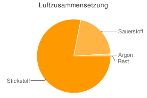

<h2>1. Oxidation</h2>

VEine Kerze wird angezündet 
BDie Kerze wird angezündet (gelbe Flamme) 
Eexotherme Reaktion: Licht und Wärme 
C15H32 + 23 O2 &#8594; 15 CO2 + 16 H2O (g) 
Wachs(eigentlich ist Wachs ein Gemisch)

<dl><dd>Reaktionen mit Sauerstoff nennt man Oxidation.</dd></dl>

VDie brennende Kerze wird in Gas gestellt:

<ol>
    <li>N2</li>
    <li>O2</li></ol>

B

<ol>
    <li>die Flamme geht aus</li>
    <li>gelbe Flamme</li></ol>

EHier liegt tatsächlich eine Reaktion mit O2 vor.

<h3>Zusammensetzung von Luft</h3>
<table>

<tr>
    <td></td>
    <td></td>
</tr>
<tr>
    <td>Die Gasglocke füllt sich mit Rauch</td>
    <td>BDie Flüssigkeit hat sich von gelb nach rot verfärbt.</td>
</tr>
</table>

(Farbstoff in Wasser) ca. 1/5 weniger V (Gas)

E4 P + 5 O2&#8594; P4O10

Wertigkeit P: V

&#8658; In Luft befindet sich ca. 20% Sauerstoff.

Das Phosphoroxid hat sich in Wasser aufgelöst und dabei die Farbe geändert.

<h4>Luftzusammensetzung</h4>

Stickstoffgas 78, 08 % N2 
Sauerstoffgas 20, 95 % O2 
Argon 0, 933 % Ar 
Kohlenstoffgas 0, 036 % CO2 
Neon 0, 0018 % Ne 
Helium 0, 0005 % He 
weitere Bestandteile Wasserdampf, Staub

<h3>Luftverschmutzung</h3>

Die moderne Zivilisation bring in zunehmendem Maß schädlich wirkende Stoffe in de Atmosphäre. 
z.B. Kohlenstoffdioxid (CO2)

<ul>
    <li>Pflanzen brauchen es für die Photosynthese 
6 CO2 + 6 H2O (Licht + Chlorophyll) &#8594; 6 CO2 + C6H12O6</li>
    <li>Ist harmlos (Wir atmen es ständig aus!)</li>
    <li>Entsteht bei der Verbrennung (Fossile Brennstoffe)</li>
    <li>Problem: Globale Klimaerwärmung (Treibhauseffekt)</li>
</ul>

<h3>Folgen der Erderwärmung:</h3>
<ul>
    <li>Abschmelzen der Polarkappen &#8594; Meeresspiegel steigt</li>
    <li>Extremeres Wetter (Stürme, Niederschläge, Dürren)</li>
    <li>Eventuell stillstand des Golfstromes &#8594; Eventuelle Abkühlung des Klimas in Europa (Eiszeit)</li>
</ul>

<h3>Was können wir tun?</h3>
<ul>
    <li>keine Tropenhölzer kaufen &#8594; keine Abholzung der Regenwälder</li>
    <li>öffentliche Verkehrsmittel nutzen</li>
    <li>Strom sparen (Energiesparlampen, Regenerative Energien, Wasser- und Windenergie, Rapsöl, Erdwärme, Atomkraft)</li>
</ul>

<table class="style1"><tbody>
<tr><th scope="col">Name</th><th scope="col">Formel</th><th scope="col">Quelle</th><th scope="col">Problematik / Besonderheiten</th>
</tr>
<tr>
    <td>Ozon</td>
    <td>O3</td>
    <td>NO2&#8594;NO 
Autobahnen </td><td class="c1">Starke Reaktion

<ul>
    <li>Zellmembranen</li>
    <li>Stoffwechselprodukte</li>
    <li>Stört Photosynthese</li>
    <li>Kautschuk / Kunststoffe</li>
    <li>Atemwege</li>
</ul>

</td>
</tr><tr class="odd">
    <td>Schwefeldioxid</td>
    <td>SO2</td>
    <td>Erdöl, Kohle 
Verbrennung 
Oxidation in Sümpfen 
(Metallgewinnung) </td><td class="c1">

<ul>
    <li>Versauerung, Rosten</li>
    <li>Waldsterben</li>
</ul>

</td>
</tr>
<tr>
    <td>Stickstoff­oxid</td>
    <td>NO2 
NO </td>
    <td>Verbrennungen an der Luft, Gewitter, Bakterien</td><td class="c1">Kann in Verbindung mit Regen zu Nitraten führen &#8594; Düngung 
sehr giftig, führt zur Bildung von Ozon </td>
</tr><tr class="odd">
    <td> Halogen­wasser­stoffe: 
Chlormethan 
Flurkohlen­wasserstoffe (FCKWs) </td>
    <td>CH3Cl 
CFCl3 
CFCl2</td>
    <td>Chemische Reaktionen im Meerwasser</td><td class="c1">In der Atmosphäre freisetzung von Cl-Atomen durch Reaktion durch Licht &#8594; Ozon wird durch Cl-Atome zersetzt. Es wird mehr Ozon zersetzt als Produziert wird:

<ul>
    <li>Entstehung eines Ozonlochs</li>
    <li>Ungiftig</li>
    <li>Nicht Brennbar</li>
</ul>

</td>
</tr>
<tr>
    <td>Kohlen­wasserstoffe</td>
    <td>CxHy</td>
    <td> Erdölförderung 
Fäulnisprozesse 
Aufbereitung, Vorrats- und Transportbehälter </td><td class="c1"> Krebserregend 
Benzol 
Schadstoffe </td>
</tr><tr class="odd">
    <td> Kohlen­wasserstoff­monoxid</td>
    <td>CO</td>
    <td>unvollständige Verbrennung 
(z.B. Auto) </td><td class="c1">

<ul>
    <li>Atemgift (verhindert den O2 Transport im Blut)</li>
    <li>Wird in der Atmosphäre schnell zu CO2 umgebaut.</li>
</ul>

</td>
</tr></tbody>
</table>

<h3>Luftreinhaltung</h3>

Beispiele:

<ul>
    <li>Müllverbrennungsanlagen</li>
    <li>Autoabgase (Kfz-Katalysator)</li>
</ul>

CO, NO, NO2, CO2, CH4

2 CO + 2 NO &#8594; N2 + 2 CO2 
CH4 + 2 O2 &#8594; 2 H2O + CO2 
CH4 + 4 NO &#8594; 2 H2O + CO2 + 2 N2

Kohlekraftwerk z.B. Rauchgasreinigung z.B. SO2

SO2 + H2O &#8594; H2SO3 
2 H2SO3 + O2 &#8594; 2 H2SO4 
CaCO3 + H2SO4 &#8594; CaSO4 + CO2 + H2O

<h3>Vielfalt und Bedeutung von Oxidationsprozessen</h3>
<ol>
    <li>Stille Oxidation (exotherm), z.B.

<ul>
    <li>Rosten von Eisen 
4 Fe + 3 O2 &#8594; 2Fe2O3 
&#916;HR< 0</li>
    <li>Zellatmung 
C6H12O6 &#8594; 6 H2O + 6 CO2 
&#916;HR< 0</li>
</ul>

</li>
    <li>Verbrennung, z.B.:

<ul>
    <li>Kerze (vereinfacht) 
C12H32 + 23 O2 &#8594; 15 CO2 + 16 H2O 
&#916;HR< 0</li>
    <li>Magnesium: 
2 Mg + O2 &#8594; 2 MgO</li>
    <li>Gasbrenner 
2 C4H10 + 13 O2 &#8594; 8 CO2 + 10 H2O 
&#916;HR< 0</li>
</ul>

</li>
    <li>Explosion, z.B.:

<ul>
    <li>Benzinmotor 
2 H2 + O2 &#8594; 2 H2O 
2 C8H18 + 25 O2 &#8594; 16 CO2 + 18 H2O 
&#916;HR &lt; 0</li>
</ul>

</li></ol><h3>Wichtige Oxide</h3>
<ul>
    <li>H2O: Wasser</li>
    <li>CO2: Nachweisreaktion für Kohlenstoffdioxidgas</li>
</ul>

Calciumhydroxidlösung Ca(OH)2 (aq.) 
Wir leiten das Testgas durch die Lösung. 
z.B. mit einem Strohalm pusten wir Atemluft durch die Lösung 
CO2 (g) + Ca(OH) (aq) &#8594; CaCO3 (s) + H2O (l)

<h3>Wichtige Oxidationsmittel:</h3>

Oxidationsmittel können Stoffe oxidieren.

C + O2 &#8594; CO2 
&#916;HR &lt; 0

hier: Sauerstoffgas O2

<ul>
    <li>O2: Zellatmung, Kerze, Raketenantrieb, Verbrennungsmotor</li>
    <li>KNO3 (Kaliumnitrat): Schwarzpulver, Feuerwerkskörper 
C + S + 4 KNO3 &#8594; 4 KNO2 + SO2</li>
    <li>H2O2 (Wasserstoffperoxyd): Bleichmittel, Desinfektionsmittel</li>
</ul>

<h3>Wichtige Säuren und Laugen:</h3>
<table class="style1"><tbody>
<tr><th scope="col">Name</th><th scope="col">Formel</th><th scope="col">Bedeutung</th>
</tr>
<tr>
    <td>Salzsäure</td>
    <td>HCl (aq.)</td><td class="c1">Entkalkung, Magensäure</td>
</tr><tr class="odd">
    <td>Ascorbinsäure (Vitamine)</td>
    <td></td><td class="c1">lebensnotwendiger Nahrungsbestandteil 
Vitamine kann der Körper nicht selbst herstellen</td>
</tr>
<tr>
    <td>Natronlauge</td>
    <td>NaOH (aq.)</td><td class="c1">Laugengebäck 
Aluminiumherstellung 
Abflussreiniger </td>
</tr><tr class="odd">
    <td>Schwefelsäure</td>
    <td>H2SO4</td><td class="c1">Batteriesäure 
Herstellung von Farben</td>
</tr>
<tr>
    <td>Salpetersäure</td>
    <td>HNO3</td><td class="c1">Herstellung von Sprengstoffen 
Kunstdünger </td>
</tr><tr class="odd">
    <td>Ammoniak</td>
    <td>NH3</td><td class="c1">Kuhstallgeruch 
Düngemittel</td>
</tr>
<tr>
    <td>Aminosäuren</td>
    <td></td><td class="c1">Bausteine der Proteine</td>
</tr></tbody>
</table>

<h3>Reduktion</h3>

V

BEs bilden sich Wassertröpfchen am Ende des Glasrohres: Das schwarze Kupferoxid wird kupferfarben (rot)

E CuO (s) + H2 (g) &#8594; Cu(s) + H2O (l) 
Reduktion: 2 CuO &#8594; 2 Cu + O2 
Oxidation: 2 H2 + O2 &#8594; 2 H2O 
2 CuO + 2 H2 &#8594; 2 Cu + 2 H2O + O2 
CuO + H2 &#8594; Cu + H2O (Redoxreaktion)

<dl><dt>Reduktion</dt><dd>Eine chemische Reaktion bei der Sauerstoff abgegeben wird.</dd></dl>

H2 ist bei dieser Reaktion das Reduktionsmittel. 
CuO ist bei dieser Reaktion das Oxidationsmittel

<h4>Weitere Reaktionen:</h4>

C + 2 KNO3 &#8594; CO2 + 2 KNO2 
C + O2 &#8594; CO2 
2 KNO3 &#8594; + O2 
2 KNO3 + C + O2 &#8594; 2 KNO2 + CO2 + O2

Anwendung: das Thermit-Verfahren 
z.B.

<ul>
    <li>Schweißen von Eisenbahnschienen</li>
    <li>Brandbomben</li>
</ul>

<h5>Technische Anwendungen von Redoxreaktionen</h5>

z.B. die Herstellung von Eisen im Hochofen (über 3000 °C)

C + O2 &#8594; CO2 
2 Fe2O3 + 3 C &#8594; 4 Fe + 3 CO2

1: Eisenerz (= Fe2O3 mit Gestein) + Koks (= speziell bearbeitete Kohle) + Zuschläge (z.B. Kalk) 
2: Gichtgas (CO2, CO, N2)

Die Zuschläge bilden zusammen mit dem Kalk die flüssige Schlacke. Sie verhindert die Oxidation der heißen Luft und des gewonnenen Eisens.

<ol>
    <li>Eisenerz, Koks und Zuschläge werden in den Hochofen gegeben.</li>
    <li>Die heiße Luft oxidiert mit einem Teil des Koks &#8658; Erwärmung</li>
    <li>Eisenoxid wird durch Koks reduziert &#8658; flüssiges Eisen entsteht</li>
    <li>Die Zuschläge bilden mit dem Gestein flüssige, auf dem Eisen schwimmende, Schlacke.</li></ol><h2>Materialien</h2>
<ul>
    <li><a href="doc/gruppierung_chemischer_reaktionen.pdf">Lerneinheit als PDF</a></li>
</ul>
