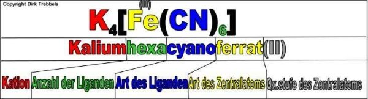
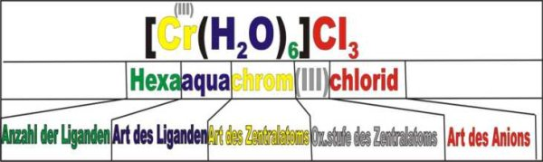
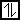
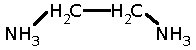

V Cu2+-Lösung wird mit NH3 versetzt

Cu2+ + 4 NH3 &#8594; [Cu(NH3)4]2+ (Komplexverbindung)

<dl><dt>Komplexverbindung:</dt><dd>Eine Komplexverbindung besteht aus mehreren Atomen, Ionen, oder Molekülen. Sie besteht also aus einem <a href="http://www.ddesignmedia.de/Komplex_Chemie/HTML/GMS/Texte/Komplex/Zentralatom/Zentralatom.htm">Zentralatom(Z)</a>, das von<a href="http://www.ddesignmedia.de/Komplex_Chemie/HTML/GMS/Texte/Komplex/Liganden/Liganden.htm">Liganden (L)</a> umgeben ist. Die Koordinationszahl(X) gibt dabei die Gesamtzahl der Liganden an.</dd></dl>

Die Allg. Summenformel für Komplexe lautet dann:

Bindungsverhältnisse:

Heterogene Spaltung

Das Zentralatom (Lewis-Säure &#8594; Elektronenpaarakzeptor) ist meist ein Kation das häufig von Übergangsmetallen gebildet wird. Die Liganden (Lewis-Base &#8594; Elektronenpaardonator) liefern in Komplexverbindungen die Elektronen für die Verbindung zwischen Ligand und Zentralatom

Dative (koordinative) Bindung:

&#8594; Beim Versuch diese Bindung zu Spalten kommt es zu einer heterolytischen Spaltung.

[Fe(CN)6]4- 
[Ni(CN)4]2- 
[Cu(CN)4]2- 
[Cu(CN)4]

Nomenklaturen der Komplexverbindungen

<table class="style1"><tbody>
<tr><th>Liganden</th><th>Zentralatome </th><th></th><th>Name</th>
</tr>
<tr>
    <td>F-, Cl-</td>
    <td>fluro, chloro</td>
    <td>Pb</td>
    <td>Blei (Plumbum)</td>
</tr><tr class="odd">
    <td>Br-, I-</td>
    <td>bromo, iodo</td>
    <td>Fe</td>
    <td>Eisen (Ferrum)</td>
</tr>
<tr>
    <td>CN-</td>
    <td>cyano</td>
    <td>Cu</td>
    <td>Kuper (Cuprum)</td>
</tr><tr class="odd">
    <td>SCN</td>
    <td>tiocyanato</td>
    <td>Ni</td>
    <td>Nickel (Nicolum)</td>
</tr>
<tr>
    <td>S2O32-</td>
    <td>tiosulfato</td>
    <td>Hg</td>
    <td>Quecksilber (<i>hydrargyrum</i>)</td>
</tr><tr class="odd">
    <td>OH-</td>
    <td>hydroxo</td>
    <td>Ag</td>
    <td>Silber (Argentum)</td>
</tr>
<tr>
    <td>H2O</td>
    <td>aqua</td>
    <td>Zn</td>
    <td>Zink (Zincum)</td>
</tr><tr class="odd">
    <td>NH3</td>
    <td>ammin</td>
    <td>Sn</td>
    <td>Zinn (Stannum)</td>
</tr>
<tr>
    <td>CO</td>
    <td>carbonyl</td><td colspan="2"></td>
</tr></tbody>
</table>

<table class="style1"><tbody>
<tr><th></th><th></th><th>Zahlen</td>
</tr>
<tr>
    <td>[COCl4]2-</td>
    <td>Tetrachlorocolbatat (II)</td>
    <td>1</td>
    <td>mono-</td>
</tr><tr class="odd">
    <td>[Al(OH)4]-</td>
    <td>Tetrahydroxoaluminat (III)</td>
    <td>2</td>
    <td>di-</td>
</tr>
<tr>
    <td>[Cu(NH3)4]2+</td>
    <td>Tetraaminkupfer (II)</td>
    <td>3</td>
    <td>tri-</td>
</tr><tr class="odd">
    <td>[Ni(CO)4]</td>
    <td>Tetracarbonylnickel</td>
    <td>4</td>
    <td>tetra-</td>
</tr>
<tr><td colspan="2"></td>
    <td>5</td>
    <td>penta-</td>
</tr><tr class="odd"><td colspan="2"></td>
    <td>6</td>
    <td>hexa-</td>
</tr>
<tr><td colspan="2"></td>
    <td>7</td>
    <td>hepta-</td>
</tr><tr class="odd"><td colspan="2"></td>
    <td>8</td>
    <td>okta-</td>
</tr></tbody>
</table>

<h2>2. Geometrie von Komplexverbindungen</h2>

Die Koordinationszahl wird durch die Größe, Ladung und durch den Raumbedarf der Liganden bestimmt.

<table class="style1"><tbody>
<tr><th>KZ</th><th>Geometrie</th><th>Beispiel: </th>
</tr>
<tr>
    <td>2</td>
    <td>linear</td>
    <td>-</td>
</tr><tr class="odd">
    <td>4</td>
    <td>sp3&#8594; tetraedrisch</td>
    <td>Ni(Cl)42-</td>
</tr>
<tr>
    <td>dsp2&#8594; quadratisch planar</td>
    <td>Ni(CN)42- (starker Ligand)</td>
</tr><tr class="odd">
    <td>6</td>
    <td>d2sp3&#8594; oktaedrisch</td>
    <td>Fe(CN)63-</td>
</tr></tbody>
</table>

<table class="style1"><tbody>
<tr><th>schwache Liganden</th><th>starke Liganden</th>
</tr>
<tr>
    <td>Cl-, NH3, I-, H2O</td>
    <td>CO, CN-</td>
</tr></tbody>
</table>

[Ar] 4s  3d  4p 

Cl- sp3 = tetraedrisch

Es dürfen bei schwachen Liganden NIEMALS einzelne Elektronen hinzugefügt werden.

NiCN

[Ar] 4s  3d  4p 

dsp2 = quadratisch planar

<h2>3. Ligandenaustauschreaktionen</h2>

V  Zu einer Eisen(II)salzlösung wird NH4SCN (Ammoniumziocyanat) hinzugefügt.

B  Blutrote Farbe

A  [Fe(H2O)6]3+ + 3 SCN- &#8594; [Fe(H2O)3SCN3] + H2O

Bei der Ligandenaustauschreaktion wird der schwächere Ligand durch den stärkeren Liganden ausgetauscht. Es bildet sich somit der stärkere Komplex.

<h2>4. Chelatkomplexe </h2>

Wenn mehr als ein Atom eines Moleküls mit dem Metall eine koordinative Bindung eingeht spricht man bei diesem Liganden von einem Chelatliganden oder von einem mehrzähnigem Liganden.

Beispiel:

Zweizahniger Ligand, Ethylendiamin (1, 2 Bioethan)

Beispiel: [Cu(ED)2]2+(Ethylendiamin)

<h4>Anwendungen der Komplexverbindungen:</h4>
<ul>
    <li>Cyanitlaugerei: 
Die Goldgewinnung läuft meist über Cyanitlaugerei bei der die Bildung eines Gold-Cyanitkomplexes ausgenutzt wird, um das Gold von anderen Metallen zu trennen. 
2 Au + H2O + 0, 5 O2 + 4 KCN &#8594; 2K[Au(CN)2] + 2KOH 
2 K[Au(CN)2] + Zn &#8594; K2[Zn(CN4)] + 2 Au</li>
    <li>Cyanit als Gift: 
Hämoglobin: Sauerstoff ist schwächer als Cyanit</li>
    <li>Katalysen: 
Komplexverbindungen als Katalysatoren (z.B.: Wackerverfahren)</li>
    <li>Komplexe in der Natur: 
Spurenelemente &#8594; kommen in Komplexen vor 
Hämoglobin; Chlorophyll; Vitamin B12 (in Fleisch)</li>
</ul>

<h2>Material</h2>
<ul>
    <li><a href="http://www.ddesignmedia.de/ani/Wacker.html">Das Wacker-Verfahren</a></li>
</ul>

Quellen: 
<a href="http://ddesignmedia.de/Komplex_Chemie/HTML/GMS/Nomenklatur/Nomenklatur1.html">Nomenklaturbilder</a>

