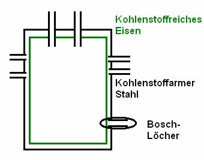

Anwendung im Labor:

Fe3+ + 3 SCN-Fe[SCN]3

gelb - farblos - tiefrot

kC = (c(C) &#8901; c(D))/(c(A) &#8901; c(B)) 
kC = c(Fe(SCN)3)/(c(Fe3+) + c3(SCN-)) (l/mol)3

Da kC eine Konstante ist muss eine Erhöhung der Konzentration der Fe3+-Ionen bzw. der Fe(SCN)3-Ionen den Nenner des Quotienten vergrößern, was eine Vergrößerung des Zählers zu Ungunsten des Nenners nach sich zieht.

2 CrO42- + 2 H3O+ 4 Cr2O72- + 3 H2O 
kC = (c(Cr2O72-) &#8901; c3(H2O))/c2(Cr2O72-) &#8901; c2(H3O+)

In verdünnten wässrigen Lösungen ist die Konzentration vom Wasser praktisch Konstant und wird in die Konstante kC aufgenommen:

kC = c(Cr2O72-)/(c2(Cr2O72-) &#8901; c2(H3O+)) (l/mol)3

<h2>3. Anwendung des MWG in der Technik</h2>

C + CO2 2 CO : Boudouard-Gleichung

kC = c2 (CO) / (c(C) &#8901; c(CO2))

Die Konzentration eines Feststoffes lässt sich nicht angeben und wird deshalb als Konstant angesehen. Der Wert beträgt 1.

kC = c2 (CO)/ (1 &#8901; c(CO2)) mol/l

<h2>4. Berechnung der Gleichgewichtskonstante</h2>

Lage des Gleichgewichts auf der Seite der Produkte: kC > 1 
Lage des Gleichgewichts auf der Seite der Edukte: kC< 1

<h2>5. Die Großtechnische Anwendung des Massenwirkungsgesetzes</h2>
<h4>a) Haber-Bosch-Verfahren (Synthese von Ammoniak)</h4>

3 H2 + N2 (Düngemittelherstellung)

Aufgabe:

In einem Behälter mit dem Volumen V = 5l und konstanter Temperatur hat sich zwischen den Gasen Stickstoff, Wasserstoff und Ammoniak ein Gleichgewicht eingestellt. Es liegen folgende Stoffmengen vor:

n(N2) = 5, 05 mol 
n(H2) = 8 mol 
n(NH3) = 0, 5 mol 
kC = c2(NH3)/(c(N2) &#8901; c3(NH3)) = 2, 4 &#8901; 10-3(l/mol)2 
p1 &#8901; V1 / T1 = p2 &#8901; V2 / T2; p1 &#8901; V1 = p2 &#8901; V2

<h4>b) Optimieren der Reaktionsbedingungen</h4>

30 bar / 200 °C &#8594; 70 %

<ul>
    <li>Temperaturerniedrigung bis zur Grenze der Aktivierungsenergie um genug Aktivierungsenergie sie darf aber nicht zu hoch sein, sonst wird der Zerfall von Ammoniak begünstigt</li>
    <li>Druckerhöhung: Begünstigt die Hinreaktion. Druck darf aber nicht zu hoch sein, sonst ist die technische Umsetzung unmöglich.</li>
    <li>Katalysator: Er sorgt für die schnelle Einstellung des Gleichgewichts</li>
</ul>

Das Ionenprodukt des Wassers (kW) ist die Konstante aus dem Produkt der Konzentrationen der H3O+- und OH--Ionen. Sie gilt nur in wässrigen, verdünnten Lösungen.

<h4>c) Technische Umsetzung des Reaktionsreaktors</h4>

Wasserstoff und Kohlenstoff reagieren bei hohem Druck

2 H2 + C  CH4

Lösung des Problems durch den Bosch-Doppelmantel. Außen Stahlmantel mit Löchern, innen Weicheisen.

Ammoniaksynthese im Kreislaufverfahren

CO: "Katalysatorgift"

Labordarstellung &#8658; industrielle Masstäbe

Verwedung von Ammoniak:

<ul>
    <li>Herstellung von Salpetersäure

<ul>
    <li>Düngemittel</li>
    <li>Nitrierung &#8658; Sprengstoffe</li>
</ul>

</li>
    <li>Kunststoffe</li>
    <li>Pflanzenschutzmittel</li>
</ul>

<h4>Stickstoffkreislauf</h4>
<a href="http://www.lfu.bayern.de/wasser/daten/grundwasser_stoffeintrag_messdaten/pic/stickstoffkreislauf_gr.jpg">Bild</a> 

CO2 ist ein offenes System

<h2>6. Offene Systeme</h2>

H2O + H2CO2 CO2 + 2H2O

Kann ein Reaktionspartner ständig aus dem Gleichgewicht entweichen, so wird das Gleichgewicht vollständig in eine Richtung verschoben.

<h4>d) pH-Wert Berechnung für starke / schwache Basen</h4>

pOH = -lg &#8901; c(OH-) &#8594; pOH = -lg &#8901; c0(A-) &#8594; für pks < 3, 5

pOH = 0, 5 (pks - lg &#8901; c(A-)) &#8594; für pkb > 3, 5

Übung: Berechne den pH-Wert folgender Lösungen:

<ul>
    <li>Essigsäure c0 = 0, 25 mol / l 
pks(CH3COOH) = 4, 75 
pH = 2, 68</li>
    <li>Ammoniak c0 = 7, 6 &#8901; 10 -4 mol/l 
pOH = 10, 06 
kC = c(H3O+)/c(X) 
kS = Konzentration der Säure 
kS &#8901; kB = kW = 14 
pks &#8901; pkb = pkw = 14</li>
</ul>

Natriumacetat NaCH3COO CH3COO - Essigsäure pH &#8593;

Natriumchlorid NaCl pH 

Amoniumchlorid NH4Cl pH &#8595;

