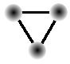
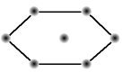
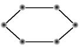
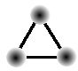
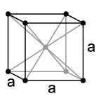
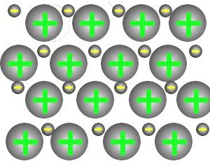
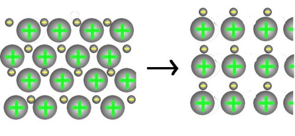

<h2>1. Geschichte der Metalle</h2>
<ul>
    <li>Kupfer: Jungsteinzeit zur Herstellung von Geräten und Schmuck; Kupferzeit: 5000 - 3000 v. Chr.</li>
    <li>Bronze: Erste Legierung, zufällig entdeckt; Kupfer und Zinnerze durch erhitzen aufbereitet; Bronze ist wesentlich härter als Kupfer; 3000 - 1000 v. Chr.</li>
    <li>Eisenzeit: Eisen wird aus Eisenerzen durch erhitzen mit Holzkohle gewonnen; 1000 v. Chr bis heute. Heute wird Eisen im Hochofenprozess durch Umsetzung mit Koks gewonnen. Roheisenfischen für Stahlaufbereitung, d.h. Kohlenstoff entfernen bis auf 1% &#8658; Stahl</li>
</ul>

<h2>2. Eigenschaften</h2>
<ul>
    <li>Reaktionsverhalten: Neigen zur Kationenbildung (Na+)</li>
    <li>elektrische Leitfähigkeit</li>
    <li>glänzend</li>
    <li>flexibel</li>
</ul>

<h2>3. Bau der Metalle und chemische Bindungen in Metallen</h2>

Metalle bestehen im festen Zustand aus einem regelmäßig aufgebautem Verbund von Atomen, dem Metallgitter. Dabei ist jedes Metallatom von vielen gleichen Atomen umgeben.

<h2>4. Kristallstruktur der Metalle</h2>
<table class="style1"><caption>a) Struktur der dichtesten Kugelpackung ~ 74% Raumausfüllung</caption><tbody>
<tr>
    <td> 
</td><th colspan="2">kubisch dichteste Kugelpackung</th><th colspan="2"> hexagonal dichteste Kugelpackung </th>
</tr>
<tr>
    <td>Ebene 1</td>
    <td>A</td>
    <td></td>
    <td>A</td>
    <td></td>
</tr><tr class="odd">
    <td>Ebene 2</td>
    <td>B</td>
    <td></td>
    <td>B </td>
    <td></td>
</tr>
<tr>
    <td>Ebene 3 </td>
    <td>A</td>
    <td></td>
    <td>C</td>
    <td></td>
</tr><tr class="odd">
    <td>Raum- ausfüllung</td>
    <td>&#960; / (3&#8901;sqrt(2))&#8776; 74%</td><td colspan="3"> 
</td>
</tr></tbody>
</table>

b) Strukturen ohne dichteste Kugelpackung

68 % Raumausfüllung - Kubisch innenzentriert

Jedes Metallatom besitzt 8 (kleine dichteste Kugelpackung) oder 12 (dichteste Kugelpackung) Nachbaratome.

<h2>5. Das Elektronengasmodell</h2>

Die Metallatome geben leicht ihre Valenzelektronen ab, welche im Metallgitter das so genannte Elektronengas bilden, in das die positiv geladenen Atomrümpfe eingebettet sind. Das Elektronengas hält die positiv geladenen Atomrümpfe zusammen.

Die Eigenschaften der Metalle kann man mit dem Elektronengasmodell der metallischen Bindung erklären:

<h3>a) Verformbarkeit</h3>

Es treten keine Abstoßungskräfte auf!

<h3>b) elektrische Leitfähigkeit</h3>

Beim Anlegen der Spannung geraten die sehr leicht beweglichen Elektronen aus dem Elektronengas in Bewegung

Die elektrische Leitfähigkeit der Metalle nimmt mit steigender Temperatur ab

<h3>c) Wärmeleitfähigkeit</h3>

Die Bewegungsenergie wird auf Nachbarteilchen übertragen &#8658; wärmeleitung

<h2>6. Die wichtigsten Gebrauchsmetalle</h2>
<ul>
    <li>Aluminium (Konstruktionswerkstoff)</li>
    <li>Kupfer (Stromkabel)</li>
    <li>Eisen (Stahl)</li>
    <li>Silber (Schmuck)</li>
    <li>Gold (Elektronik)</li>
    <li>Platin (Katalysator)</li>
</ul>

Eisen, Kobalt und Nickel sind ferromagnetisch, sie lassen sich durch ein Magnetfeld dauerhaft magnetisieren.

<h2>7. Legierungen</h2>

Legierungen entstehen durch Zusammenschmelzung von Metallen und sie besitzen häufig vorteilhafte Eigenschaften als das Grundmetall.

<ul>
    <li>Messing: Kupfer und Zink</li>
    <li>Bronze: Kupfer und Zinn</li>
    <li>Stahl: Edelstahl &#8658; Chrom / Nickel oder Wolfram</li>
    <li>Neusilber: Kupfer, Nickel, Zink</li>
</ul>

<h2>8. Edelmetalle</h2>
<ul>
    <li>sehr selten</li>
    <li>meist Dichte über 5 g / cm3</li>
    <li>sehr reaktionsträge</li>
    <li>gegen verdünnte Säuren widerstandsfähig</li>
    <li>Beispiele: Silber, Gold, Platin</li>
</ul>

 Quellen: 
<a href="http://de.wikipedia.org/wiki/Bild:Cubic-body-centered.png">Kubisch-innenzentriert</a>

