
(=Stoffe, die aus Molekülen (=ungeladene Teilchen aus mind. 2 Atomen) aufgebaut sind.)

<h2>1. Bindungen</h2>

Bsp.: H2, O2, N2, CO, CO2, C6H12O6

&#8594; Bindung zwischen Nichtmetallen

Ein-Atom-Bindung: 
H + H &#8594; H2 &#916;H << 0 Bindungsenthalpie 
H2 &#8594; H + H &#916;H >> 0 Dissotiationsenthalpie

Die H-Atome in Molekül werden von starken Bindungskräften zusammen gehalten &#8594; stabiler, energiearmer Zustand.

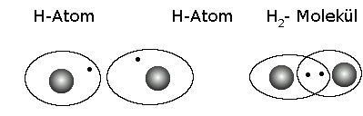

Die beiden Atome durchdringen sich mit ihren Elektronenwolken. Die beiden e- halten sich bevorzugt im Bereich zwischen den beiden Atomkernen auf.

&#8658; Anziehung auf die beiden positiv geladenen Atomkerne.

&#8658; Bildung eines gemeinsamen Elektronenpaares. Die Bindung zwischen den Atomen in Molekülen erfolgt durch gemeinsame Elektronenpaare. Sie wird Elektronenpaarbindung bzw. Atombindung bzw. kovalänte Bindung genannt.

<h2>2. Die Valenzstrichformel</h2>

Beispiel:

Valenzstrichschreibweise:

Angabe aller Valenz-e- als Punkt (ungepaarte) oder Strich (e--Paare)

<h2>3. Die Bindigkeit</h2>

Beispiel: H2 Wasserstoffatome sind immer einbindig.

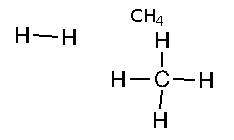

Bindigkeit: Zahl der Elektronenpaare, die ein Atom mit anderen Atomen teilt. 
Bindigkeit: Bedarf des Nicht-Metall-Atoms an zusätzlichen e- um e--Oktett zu erreichen.

<h2>4. Mehrfachbindungen</h2>

Beispiel:

 
<table class="style1"><tbody>
<tr><th></th><th>Fluor (Einfachbindung)</th><th>N (Dreifachbindung)</th>
</tr>
<tr><th>Bindungslänge (in pm)</th>
    <td>142</td>
    <td>110</td>
</tr>
<tr><th>Bindungsenthalpie (in kJ / mol)</th>
    <td>-157</td>
    <td>-949</td>
</tr></tbody>
</table>

<h2>5. Aufstellen von Valenzstrichformeln für Verbindungen</h2>

Elektronenmangelverbindung

ClF3 - Chlortrifluorid

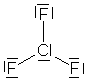

Oktettregel nicht erfüllt!

<table class="style1"><tbody>
<tr>
    <td>SO42-</td>
    <td>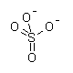</td>
    <td>Überschreitung der Oktettregel für Elemente ab der 3. Periode möglich</td>
</tr></tbody>
</table>

<h2>6. Räumliche Gestalt von Molekülen</h2>
<table>
<tbody>
<tr>
    <td>Bsp.: CO2</td>
    <td>und H2O</td>
</tr>
<tr>
    <td></td>
    <td>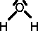</td>
</tr></tbody>
</table>

Elektronenpaar-Abstoßungs-Modell (VSEIR-Modell):

Regel 1: Die Elektronenpaare ordnen sich aufgrund ihrer Abstoßung möglichst weit voneinander Entfernt an.

<table class="style1"><tbody>
<tr>
    <td>CO2</td>
    <td></td><th>linear</th>
</tr>
<tr>
    <td>BF3</td>
    <td>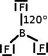</td><th>Trigonal-planar (gleichseitiges Dreieck)</th>
</tr>
<tr>
    <td>CH4</td>
    <td>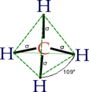</td><th>Tetraeder</th>
</tr></tbody>
</table>

Regel 2: Freie Elektronenpaare am Zentralatom müssen mit berücksichtigt werden. Sie beanspruchen sogar einen größeren Raum als bindende Elektronenpaare.

<table class="style1"><tbody>
<tr>
    <td>NH3</td>
    <td>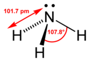</td><th>Trigonale Pyramide 
(Dreieckspyramide)</th>
</tr>
<tr>
    <td>H2O</td>
    <td>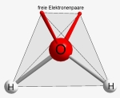</td><th>gewinkelt</th>
</tr>
<tr>
    <td>N2</td>
    <td></td><th>linear</th>
</tr></tbody>
</table>

Regel 3: Mehrfachbindungen werden wie Einfachbindungen behandelt.

<h2>7. Die polare Atombindung</h2>

Beispiel.: HCl

Das bindende e- Paar ist im statistischen Mittel zum Cl-Atom hin verschoben.

Folge: Anhäufung negativer Ladung auf der Seite des Cl-; Verringerung auf der Seite des H-Atoms.

Grund: Teile mit unterschiedlichen Atomen üben beide Beindungspartner unterschiedlich starke Anziehungskräfte auf die bindenden e- aus.

Schreibweise:oder 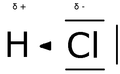

Es bilden sich innerhalb des Moleküls sog. Teil- oder Partialladungen aus.

&#948;+ positive Partialladung ist vom Betrag genauso groß wie &#948;-

<dl><dd>Atombindungen, die zwischen Atomen unterschiedlicher Elemente bestehen und deren Bindungselektronen zu einem Partner hin verschoben sind, nennt man Polar.</dd></dl><h3>Ist ein Molekül polar?</h3>
<ol>
    <li>Schritt: Valenzstrichformel aufstellen</li>
    <li>Schritt: Prüfen der Polarität 
EN(N) = 3, 04 
EN(H) = 2, 20 
&#916;EN = 0, 84 (> 0, 5) 
N-H-Bindungen sind polar. </li>
    <li>Schritt: Molekülsymmetrie (Bestimmung des positiven und negativen Ladungsschwerpunktes)</li></ol>

Bei dem Beispiel ist der negative Ladungsschwerunkt bei N, der positive zwischen den H.

Molekülsymmetrie &#8594; negativer Ladungsschwerpunkt bei dem N-Atom, positiver Ladungsschwerpunkt in der Mitte

<h3>Elektronegativität</h3>

Maß für das Bestreben eines Atoms innerhalb einer Elektronenpaarbindung die Bindungselektronen an sich zu ziehen.

Die EN ist umso größer ... 
... umso kleiner der Atomradius ist 
... umso größer die Kernladung ist

EN im PSE:

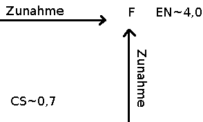

Die Polarität der Atombindung hängt von der Differenz der EN der Bindungspartner ab.

<table>
<tbody>
<tr>
    <td>

EN(H) = 2, 20

EN(Cl) = 3, 16

_____________

&#916; EN = 0, 96

</td>
    <td>

EN(H) = 2, 20

EN (F) = 3, 98

____________

&#916; EN = 1, 78

</td>
</tr></tbody>
</table>

Konvention: 
&#916; EN < 0, 5 &#8594; unpolare Atombindung 
&#916; EN > 0, 5 &#8594; polare Atombindung

Zusammenhang: Bindungspolarität - Bindungsenthalpie &#916; HB

: &#916;HB = -431 kJ/mol 
 
: &#916;HB = -567 kJ/mol

Bindungsenthalpie > &#8658;polarer

<h2>8. Dipole</h2>
<table class="style1"><tbody><tr class="odd">
    <td>HCl</td>
    <td>CO2</td>
</tr>
<tr>
    <td>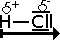</td>
    <td>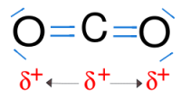</td>
</tr><tr class="odd"><td class="c1">positiver Ladungsschwerpunk am H-Atom, negativer am Cl-Atom 
&#8658;Dipol </td><td class="c1">EN(O) = 3, 44 
EN(C) = 2, 55 
&#916; EN = 0, 89 
positiver und negativer Ladungsschwerpunkt fallen in der Mitte zusammen &#8594; heben sich auf 
&#8658;keine Molekülpolarität</td>
</tr></tbody>
</table>

<h2>9. Wasser - ein typisches Dipolmolekül</h2>

V Ablenkung eines Wasserstrahls durch einen elektrisch geladenen Stab

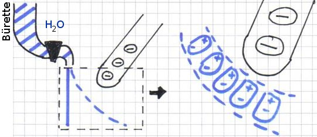

Elektrostatisches Feld? Der Effekt beruht auf der Ausrichtung der H2O-Atome.

Dipole in der Nähe der Ladung &#8658; elektrostatische Anziehung

<h2>10. Die Wasserstoffbrückenbindung</h2>

Auffällig: sehr hoher Siedepunkt des Wassers (100°C) im Vergleich zu ähnlichen Verbindungen. 
Schlussfolgerung: Zusammenhalt der H2O-Moleküle muss sehr groß sein. 
Erklärung: Wasser ist ein Dipol und zieht andere Wasser-Dipole an.

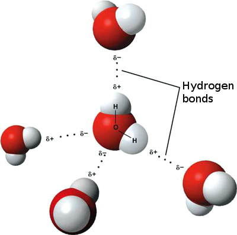

Elektrostatische Anziehungskraft (Wechselwirkung) zwischen entgegengesetzt geladenen Polen (Partialladungen) von Dipol-Molekülen.

&#8658;Dipol-Dipol-Wechselwirkung

&#8658; Bildung lockerer Verbände von Molekülen (Molekülaggregate)

Spezialfall: Wasserstoffbrückenbindung (HBB)

= Dipol-Dipol-Kräfte, die zwischen Atomen und stark EN-Partnern (meist O-Atome) ausgebildet werden.

<h2>11. Van-der-Waals Kräfte</h2>

= zwischenmolekulare Anziehung zwischen unpolaren Molekülen

Prinzip:

<ul>
    <li>momentane Dipole durch die Bewegung der Bindenden e- einer Atombindung</li>
    <li>Induktion eines Dipolmomentes im Nachbarmolekül &#8658; Elektrostatische Anziehung momentaner Dipole</li>
</ul>

&#8658;Sehr schwache zwischenmolekulare Anziehung

<h2>12. Die Dichteanomalie des Wassers</h2>

Eis schwimmt auf Wasser

Wasser besitzt bei +4 °C die größte Dichte.

Erklärung:

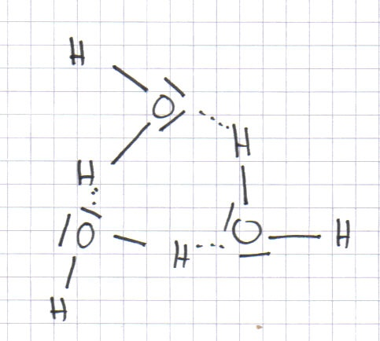<h3>Überblick über Bindungstypen in der Chemie</h3>
<table>

<tr>
    <td> Inter- oder Zwischenmolekulare Bindungen: 
&#8658; Dipol-Dipol (polar) 
&#8658; Wasserstoffbrückenbindung (HBB) 
&#8658; Van-der-Waals Kräfte (unpolar)</td>
    <td> &#8658; Elektronenpaarbindung (Molekulare Stoffe) 
&#8658; Ionenbindung (Salze)</td>
</tr>
</table>

<h2>13. Wasser als Lösungsmittel</h2>
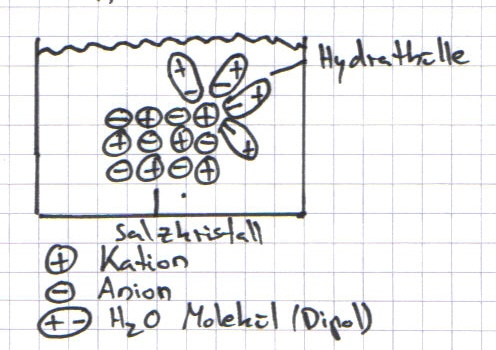

<ul>
    <li>H2O-Dipole werden von den Ionen angezogen</li>
    <li>Anlagen von H2O-Molekülen um die Ionen</li>
    <li>&#8658; Bildung einer Hydrathülle = Hydratation</li>
</ul>

Schreibweise NaCl(s) &#8594; Na+ (aq) + Cl- (aq)

Alle Ionen besitzen in wässriger Lösung eine Hydrathülle.

Löslich in Wasser:

<ul>
    <li>Salze (bis auf ein paar Ausnahmen)</li>
    <li>polare Moleküle</li>
</ul>

<h2>14. Vom Kleinmolekül zum Makromolekül</h2>

Makromoleküle ("Riesenmoleküle") = 100+ Atome mit Elektronenpaarbindungen verknüpft

Kunststoffe: Polyethylen PE, PP, PE, PS

Ethylen (Ethen): C2H4 (Monumere)

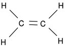

Erdöl: viele Sauerstoff / Wasserstoff Gemische

Polymerisation:

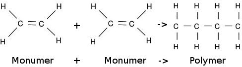 
<h2>15. Die Modifikationen des Kohlenstoffs</h2>

(s. AB)

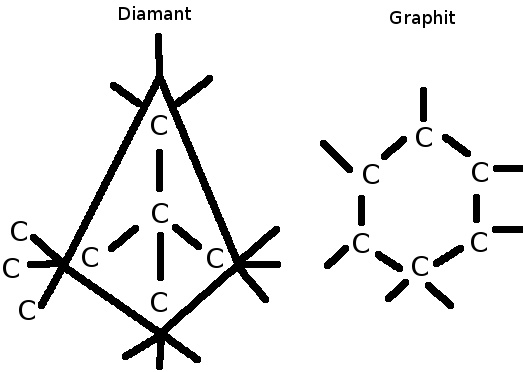<h2>Material</h2>
<ul>
    <li><a href="doc/modifikationen_des_kohlenstoffs.pdf">Modifikationen des Kohlenstoffes</a></li>
    <li><a href="http://www.youtube.com/watch?v=QqjcCvzWwww">Video über die Ionenbindung</a></li>
    <li><a href="http://www.youtube.com/watch?v=ekbwTx0ZuUQ">Lewisschreibweise eines Nitritions</a>, <a href="http://de.wikipedia.org/wiki/Nitrite">Nitrite</a></li>
</ul>

 Quellen: 
<a href="http://commons.wikimedia.org/wiki/Image:Ch4-structure.png">Struktur von CH4</a> 
<a href="http://commons.wikimedia.org/wiki/Image:Lewis_CO2.svg">Lewis-Struktur von CO2</a> 
<a href="http://commons.wikimedia.org/wiki/Image:H2O-Tetraeder.jpg">H2O-Tetraeder</a> 
<a href="http://commons.wikimedia.org/wiki/Image:3D_model_hydrogen_bonds_in_water.jpg">Wasserstoffbrückenbindung</a> 

