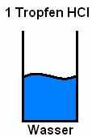
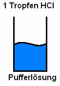

Diese Lerneinheit setzt die Kenntnis folgender Seiten voraus:

<ol>
    <li><a href="redoxgleichung_erstellen.htm" >Erstellen einer Redoxgleichung</a></li></ol>
<h2>1. Wiederholung</h2>

HCl + NaOH &#8594; NaCl + H2O 
2 H3PO4 + 3 Ca(OH)2 &#8594; 6 H2O + Ca3(PO4)2

<h2>2. Protolysereaktionen</h2>

H+-Austausch

Säuren: Protonendonatoren 
Anionen-Säuren: H2PO4-, HCO3-, HSO4- 
Neutralsäuren: HCl, HNO3, HBr, CH3OOH (Essigsäure) 
Kationensäure: H3O+, NH4+ 
Basen: Protonenakzeptoren 
Anionen-Basen: OH-, HSO4- 
Neutralbasen: NH3, H2O 
Kationenbasen: 
Spezialfall Ampholyte: H2O, H2SO4

 

Protolyse- vorgang: H3PO4 + OH- &#8594; H2PO4- + H2O 
Säure I + Base I &#8594; Base II + Säure II

Allgemein: 
An jeder Protolysereaktion sind stets zwei korrespondierende Säure-Base-Paare beteiligt.

<h2>3. Autoprotolyse des Wassers</h2>
 

Gegeben:

; V = 1l; ; 

Gesucht: kc

<h2>4. Das Ionenprodukt des Wassers</h2>
 
 
 

 bei 22 °C

4. 1 mol HI wird in einem verschließbaren Galskolben (V = 1 l) gefüllt. Wieviel mol HI liegen noch vor, wenn sich der Gleichgewichtszustand eingestellt hat?

kc=25 
H2 + I2 2HI 
kc = c2(HI)/(c(H)+c(I)) = 25

<h2>5. Der pH-Wert</h2>
<h4>a) Allgemeines</h4>

Beispiel:

analog:

Bestimme: pH

c(OH-) = 10-2 mol / l 
kW = 10-pOH &#8901; 10-pH 
14 = pH + pOH 
pOH = 2 &#8658; pH = 12

<h4>b) Rechenbeispiele:</h4>

Gilt nur bei starken Basen / Säuren, da das Gleichgewicht nahezu ganz rechts ist.

Bestimme den pH-Wert von einer Salzlösung bei der die H3O+-Ionen-Konzentration 4, 7 &#8901; 10-9 beträgt.

pOH = -lg(4, 7 &#8901; 10 -9) = 8, 3 
pH = 5, 5

<h2>6. pH / pOH-Wert von starken Säuren / starken Basen</h2>

starke Säuren: HCl, HBr, HI, H2SO4, HNO3 
starke Basen: NaOH, KOH 
Beispiel: HCl + H2O  Cl- + H3O+

Bei starken Säuren liegt das Gleichgewicht nahezu vollständig auf der rechten Seite (Produktseite). Gleiches gilt bei starken Basen

Rechenbeispiel:

c(HCl)= 0, 01 mol / l 
c(H3O+)= c(HCl) 
pH= 2 = -lg(0, 01)

<h2>7. Messung des pH-Wertes</h2>
<h4>a) Indikator</h4>
<ul>
    <li>Universalindikator</li>
    <li>Lackmus</li>
    <li>Phenolphtalein</li>
    <li>Pflanzen</li>
</ul>

<h4>b) pH-Meter</h4>

elektronische Messung (Leitfähigkeit, Konzentration der H3O+-Ionen)

<h2>8. Säure- bzw. Basenkonstante</h2>
<h4>a) Die Säurekonstante</h4>

Allgemein: HA + H2O  A- + H3O+

KS=Kc=c(A- &#8901; c(H3O+)/(c(H2O) &#8901; c(HA)))=c(H3O+) &#8901; c(A-/c(HA)) mol /l 
pkS = -lg(KS)

<h4>b) Die Basenkonstante</h4>

Allgemein: A- + H2O  HA + OH-

KB=KC=c(HA) &#8901; c(OH-)/c(A-)

Je größer der KB-Wert, desto stärker ist die Base. 

Je größer der pkB-Wert, desto schwächer ist die Base.

<h4>c) Anwendung auf korrespondierende Säure-Base-Paare</h4>

KS &#8901; KB = c(OH-) &#8901; c(H3O+) = KW = 10 -14

<h4>d) Vorhersage von Protolysereaktionen</h4>

Beispiel:

pkS(HNO3) = -1, 32 
pkS(F-) = 10, 86 
pkS(NO3-) = 15, 32 
pkS(HF) = 3, 14

HNO3 + F- NO3- + HF

Hinreaktion ist begünstigt, da HNO3 am stärksten ist und ein Proton abgibt.

<h2>9. ph-Wert Berechnungen</h2>
<h4>a) ph-Wert gebräuchlicher Lösungen</h4>
<ul>
    <li>WC-Reiniger: 3, 2</li>
    <li>Milch: 6, 5</li>
    <li>Allesreiniger: 8, 5</li>
    <li>Rohrwasser: 9, 3</li>
</ul>

<h4>b) pH-Wert starker Säuren (pkS &#8804; 3, 5)</h4>

c0(HA) = c0(HA) 
c(H3O+) = c(A-) 
kS=c(H3O+)2/c(HA) 
c(H3O+)2= kS &#8901; c(HA) 
c(H3O+) = sqrt(kS &#8901; c(HA))

<h4>c) pH-Wert schwacher Säuren (pkS &#8805; 3, 5)</h4>

HA + H2O  H3O+ + A- 
c0(HA) = c0(HA) 
c(H3O+) = c(A-) kS = c(H3O+)2 / c(HA) 
c(H3O+)2 = kS &#8901; c(HA) 
c(H3O+) = sqrt(kS &#8901; c(HA))

<dl><dd></dd></dl><h2>10. pH-Wert von wässrigen Lösungen mit Salz</h2>

V NaCH3COO&#8594; pH &#8593;

NaCl&#8594; pH bleibt konstant (neutral)

NH4Cl&#8594; pH &#8595;

A CH3COO + NaOH &#8594; NaCH3COO + H2O

starke Säure + Base &#8594; Salz&#8594;

HCl+ NaOH&#8594; NaCl + H2O 
stark stark 
NH3 + HCl &#8594; NH4Cl

<dl><dd>Salze starker Basen und schwacher Säuren reagieren in wässriger Lösung basisch.</dd><dd>Salze schwacher Basen und starker Säuren reagieren in wässriger Lösung sauer.</dd><dd>Salze starker Basen und starker Säuren reagieren in wässriger Lösung neutral.</dd></dl><h4>Übungsbeispiele zu wässrigen Salzlösungen</h4>
<ul>
    <li>KCl</li>
    <li>KCN</li>
    <li>Na2HPO4</li>
    <li>KHSO4</li>
</ul>

<table class="style1" summary="Übungsbeispiele zu wässrigen Salzlösungen"><caption>Lösungen</caption><tbody>
<tr><th></th><th scope="col">Säure</th><th scope="col">+</th><th scope="col">Base</th><th scope="col"></th><th scope="col">Salz</th><th scope="col">+</th><th scope="col">Wasser</th><th></th>
</tr>
<tr>
    <td>1.</td><td class="c1">HCl (stark)</td>
    <td>+</td>
    <td>KOH</td>
    <td></td>
    <td>KCl</td>
    <td>+</td>
    <td>H2O</td>
    <td>neutral</td>
</tr><tr class="odd">
    <td>2.</td><td class="c1">HCN (schwach)</td>
    <td>+</td>
    <td>KOH</td>
    <td></td>
    <td>KCN</td>
    <td>+</td>
    <td>H2O</td>
    <td>basisch</td>
</tr>
<tr>
    <td>3.</td><td class="c1">H3HPO4 (stark)</td>
    <td>+</td>
    <td>2 NaOH</td>
    <td></td>
    <td>Na2HPO4</td>
    <td>+</td>
    <td>H2O</td>
    <td>neutral</td>
</tr><tr class="odd">
    <td>4.</td><td class="c1">H2SO4 (stark)</td>
    <td>+</td>
    <td>KOH</td>
    <td></td>
    <td>KHSO4</td>
    <td>+</td>
    <td>H2O</td>
    <td>neutral</td>
</tr></tbody>
</table>

Bei zweiprotonigen sowie dreiprotonigen Säuren muss überprüft werden, ob es vollständig reagiert ist.

<h2>11. Puffersysteme</h2>
<table class="style1"><tbody>
<tr>
    <td></td>
    <td></td>
</tr>
<tr>
    <td>&#916;pH nach Zugabe: 
&#8594; 0, 71 </td>
    <td>&#916;pH nach Zugabe: 
&#8594; 0, 04 </td>
</tr></tbody>
</table>

<dl><dt>Säure-Base-Puffer</dt><dd>Ein Säure-Base-Puffer ist ein Gemisch einer schwachen Säure und ihrer korrespondierenden Base oder ein Gemisch aus einer schwachen Base und ihrer korrespondierenden Säure.</dd></dl>

Puffer halten den pH-Wert nach Zugabe von Laugen oder Säuren beinahe konstant.

CH3COOH + H2O  CH3COO- + H3O+

CH3COOH: schwache Säure

Hinreaktion puffert H3O+ zugabe, Rückreaktion puffert OH- zugabe

kS = c(A-) &#8901; c(H3O+)/c(HA) 
c(H3O+) = kS &#8901; c(HA)/c(A-)

<dl><dt>Henderson-Hasselbalch-Gleichung</dt><dd></dd><dt>Pufferkapazität</dt><dd>Die Pufferkapazität ist nicht unbegrenzt, wenn z.B. in Essigsäure Acetat-Ionen (CH3COO-) zu Essigsäure-Molekülen reagiert haben (oder umgekehrt), dann ist die Pufferkapazität erschöpft.</dd></dl>

Beispiele für Puffer:

<ul>
    <li>NH3 / NH4+ - Puffer &#8594; pH &#8776; 9, 2 ± 1</li>
    <li>HCO3- / H2CO3 - Puffer &#8594; pH &#8776; 6, 5 ± 1 (im Blut, Carbonatpuffer)</li>
    <li>CH3COOH / CH3COO- - Puffer &#8594; pH &#8776; 4, 75 ± 1</li>
</ul>

Rechnungen: <a href="11_ph-wert.htm">Übungsaufgaben zum ph-Wert</a>

<h4>Anwendung / Vorkommen des Puffers / Bedeutung für den Menschen:</h4>

Das Blut benötigt einen pH-Wert von 7, 4 um eine optimale Enzymaktivität zu gewährleisten.

Dafür sorgen mehrere Puffersysteme:

<ul>
    <li>Kohlensäure-Puffer H2CO3 / HCO3-</li>
    <li>Hämoglobin-Puffer</li>
</ul>

<h2>12. Säure-Base-Indikatoren</h2>

V Einzelne Indikatoren und ihre Umschlagsfarbe bzw. Farbbereiche

<table class="style1"><tbody><tr class="odd">
    <td>sauer</td>
    <td>rot</td><td rowspan="3">Methylorange, eher sauer: 
Umschlagsbereich 3, 1 - 4, 4</td>
</tr>
<tr>
    <td>neutral</td>
    <td>orange</td>
</tr><tr class="odd">
    <td>basisch</td>
    <td>gelblich-orange</td>
</tr>
<tr>
    <td>sauer</td>
    <td>weiß, milchig</td><td rowspan="3">Phenolphtalein, eher basisch: 
8 - 9, 8 </td>
</tr><tr class="odd">
    <td>neutral</td>
    <td>:</td>
</tr>
<tr>
    <td>basisch</td>
    <td>rot</td>
</tr><tr class="odd">
    <td>sauer</td>
    <td>gelb</td><td rowspan="3">Bromthymolblau 
6 - 7, 5</td>
</tr>
<tr>
    <td>neutral</td>
    <td>grün</td>
</tr><tr class="odd">
    <td>basisch</td>
    <td>blau</td>
</tr></tbody>
</table>

Pflanzen: Sud des Blaukrauts (Bioindikatoren)

gelb &#8594; rot &#8594; grün &#8594; blau &#8594; violett

<h4>a) Wirkungsweise</h4>

HInd. + H2O  Ind- + H3O+

Farbe I  Farbe II

Säure-Base-Indikatoren sind Farbstoffe, die als schwache Säure oder Basen fungieren. Die Indikatorsäure (HInd.)

