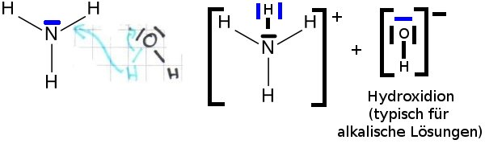
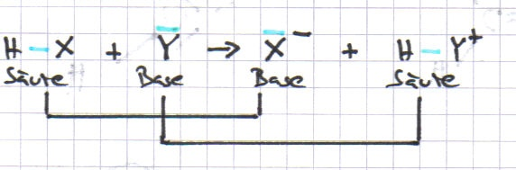
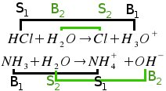

<h2>1. Wasserstoffchlorid, eine Säure</h2>
<h2>2. Ammoniak, eine Base</h2>

V Einleiten von Ammoniak-Gas in Wasser 
B Farbumschlag des Indikators Phenolphtalein von farblos nach pink. 
E Es ist eine Lauge (Alkalische Lösung) entstanden.

Ammoniak bildet in Wasser Hydroxid-Ionen (OH-), in den das Molekül ein Proton von Wasser aufnimmt (HCl-Molekül ist Säure)

N + Cl &#8594; NCl (Amoniumchlorid)

<h2>3. Säure-Base-Definition nach Brönstedt</h2>
<dl><dt>Säure-Base-Definition nach Brönstedt</dt><dd>Säuren sind Stoffe, die Protonen abgeben, sie werden nachher Protonendonnatoren.</dd><dd>Basen nehmen Protonen auf, sie sind Protonenakzeptoren.</dd><dd>Bei einer Säure-Base-Reaktion (Protolyse) findet immer einen Protonenübergang von der Säure (Protonendonator) zur Base (Protonenakzeptor) statt.</dd></dl>

Allgemein

(Reaktion auch von Rechts nach Links!)

An jeder Säure-Base-Reaktion sind zwei sog. korrespondierende Säure-Base-Paare beteiligt.

<h2>4. Ampholyte</h2>

Je nach Reaktionspartner können manche Stoffe sowohl als Säure als auch als Base reagieren. Solche Stoffe nennt man Ampholyte.

<table class="style1"><caption>Ausschließend für:</caption><tbody>
<tr><th>Base:</th><th>Säure:</th>
</tr>
<tr>
    <td>Freies e--Paar 
Valenzelektronen / Schale 
</td>
    <td>Kein H-Atom</td>
</tr></tbody>
</table>

Typische Ampholyte:

<ul>
    <li>H2O</li>
    <li>NH2 (eher Base)</li>
    <li>HSO4-</li>
    <li>HCO3-</li>
    <li>H2PO4-</li>
    <li>HPO42-</li>
    <li>HS-</li>
</ul>

<h2>Material</h2>
<ul>
    <li>Diese Seite <a href="doc/protonenuebergaenge.pdf">downloaden</a></li>
</ul>
