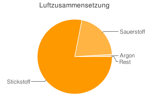

Die Qualität einer Website spielt eine wesentliche Rolle, wenn man mit ihr lernen will. Aus diesem Grund definiere ich hier eine Qualitätsmerkmale, die ich mit der Zeit auf jeder Seite anwenden will. 
Eine Website muss ...

<ul>
    <li>... standartkonform sein (der Code muss richtig geschrieben sein)</li>
    <li>... sprachlich korrekt sein</li>
    <li>... inhaltlich korrekt sein</li>
    <li>... gut gegliedert sein</li>
    <li>... gut aussehen</li>
</ul>

<h2>Standarts</h2>
<ul>
    <li>Alle Seiten müssen XHTML 1.0 Strict sein &#8594; <a href="http://validator.w3.org/">W3C Validator</a></li>
    <li>Alle Links müssen funktionieren</li>
    <li>Jede Seite beginnt mit <h1> beginnen</li>
    <li><h1> gibt es nur ein mal</li>
    <li><h1> stimmt mit dem <title> überein</li>
    <li>Geg.:; Ges.: werden (mit Doppelpunkt) unterstrichen</li>
    <li>Die Überschriften sind hierarchisch aufgebaut (<h1>, dann <h2> ...)</li>
    <li>Tabellen haben das "summary"-Attribut</li>
    <li>Überschriften in Tabellen haben das "scope"-Attribut</li>
    <li>Doppelpunkte werden mit unterstrichen</li>
    <li>Definitionen werden im Code als solche gekennzeichnet und sind immer im Singular</li>
</ul>

<h2>Datenvisualisierung</h2>
<h3>Diagramme</h3>
<h4>Kreisdiagramm</h4>

Ein <a href="http://de.wikipedia.org/wiki/Kreisdiagramm">Kreisdiagramm</a> wird erstellt wenn man Anteile darstellen will.

<h4>Säulen- oder Balkendiagramme</h4>

<a href="http://de.wikipedia.org/wiki/S%C3%A4ulendiagramm">Säulendiagramme</a> sollte man verwenden, wenn man Größen vergleichen will

<a href="http://www.maani.us/xml_charts/index.php?menu=Gallery&submenu=Donut">Hier</a> ist noch eine schöne Umsetzung mit XML und Flash.

