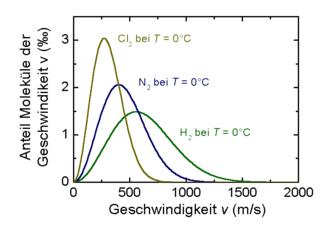
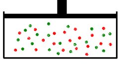
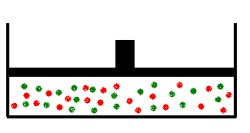
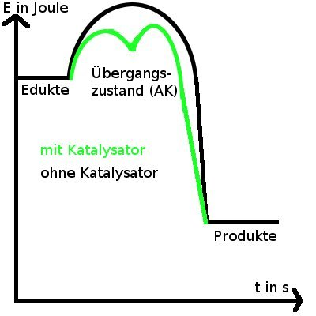

<h2>2.1. Zerteilungsgrad</h2>

V Unterschiedlicher Zerteilungsgrad von Magnesium mit Salzsäure

Pulver -Oberfläche- Band

B Wasserstoffreaktion

A

Reduktion: 2H3O+ + e- &#8594; H2 + 2H2O 
Oxidation: Mg &#8594; Mg2+ + 2e- 
(2 CL-) + Mg + 2H3O+ &#8594; H2 + 2H2O + Mg2+

Bei feiner Verteilung wird die Oberfläche des Feststoffes vergrößert. Damit wächst die Zahl und somit die Konzentration der reaktionsbereiten Teilchen an der Oberfläche. Die Reaktionsgeschwindigkeit wird dadurch gesteigert.

Anwendungen / Vorkommen im Alltag:

<ul>
    <li>Lunge z.B. der Säugetiere, sehr große Oberfläche</li>
    <li>Menschlicher Darm, ebenfalls sehr große Oberfläche (ca 400 - 500 m2)</li>
</ul>

Beides dient zur Stoffaufnahme &#8658; möglichst viel Kontaktfläche

Übungen:

Natrium + Salpetersäure:

2Na + HNO3 &#8594; 2NaNO3 + H2

Barium + Schwefelsäure

Ba + H2SO4 &#8594; BaSO4 + H2

<h2>2.2. Abhängigkeit von der Temperatur</h2>

V Reaktion von verdünnter Salzsäure und Na2S2O3 (Natriumthiosulfat)

B Mit heißer Salzsäure läuft die Reaktion schneller ab.

A

S2O32- + 2H3O+ &#8594; H2S2O3 + 2 H2O (schnell) 
H2S2O3 &#8594; S + SO2 + H2O (langsam) 
S2O32- + 2H3O+ &#8594; S + SO2 + 3H2O

Ein erfolgreicher Zusammenstoß setzt eine Mindestgeschwindigkeit und die richtige Orientierung der Teilchen voraus. 
Bei Erhöhung der Temperatur wird die Anzahl der Teilchen, die die Mindestenergie (Aktivierungsenergie) überschreiten, größer.

Maxwell-Boltzmann-Verteilung:

Die Flächen der grünen und der blauen Kurve sind gleich. Sie steht für die kinetische Energie der Teilchen.

<dl><dt>RGT Regel:</dt><dd>Bei einer Temperaturerhöhung um 10 °C verdoppelt bis verdreifacht sich die Reaktionsgeschwindigkeit.</dd></dl><h2>2.3 Abhängigkeit von der Konzentration</h2>

V Mg und HCl 
B Bei höherer Konzentration der HCl läuft die Reaktion schneller ab! 
A Mg &#8594; Mg2+ + 2e-

Je höher die Konzentration, desto schneller läuft die Reaktion ab. Die Reaktionszeit ist umgekehrt proportional zur Ausgangskonzentration

t ~ 1/c

<dl><dt>Das Massenwirkungsprodukt</dt><dd>Die Geschwindigkeit einer chemischen Reaktion ist proportional dem Produkt der Konzentrationen der Ausgangsstoffe. Bei höherer Konzentration ist die Wahrscheinlichkeit, dass sich zwei Teilchen berühren, größer als bei niedrigerer Konzentration.</dd></dl>

<table>
<tbody>
<tr>
    <td>RG ~ c(H2)</td>
    <td>RG = k1 &#8901; k2&#8901;c(H2)&#8901;c(I2)</td>
</tr>
<tr>
    <td>RG ~ c(I2)</td>
    <td>RG = k &#8901; c(H2)&#8901;c(I2)</td>
</tr></tbody>
</table>

<h2>2.4. Abhängigkeit vom Druck</h2>

Druckerhöhung beschleunigt Reaktionen bei Stoffsystemen, an denen mindestens ein Gasförmiger Reaktionspartner beteiligt ist.

<table>
<tbody>
<tr>
    <td>V1</td>
    <td>V2</td>
</tr>
<tr>
    <td></td>
    <td></td>
</tr>
<tr><td colspan="2"> V1 > V2 
c1 &lt; c2 
RG1 &lt; RG2 
p1 &lt; p2 
</td>
</tr></tbody>
</table>

Fazit: Die Reaktionsgeschwindigkeit ist direkt Proportional zu dem Druck. Eine Druckerhöhung bewirkt eine Konzentrationserhöhung.

<h2>2.5. Abhängigkeit vom Katalysator</h2>

V Wasserstoffperoxyd wird mit Hilfe von Braunstein zersetzt (bei Normalbedingungen)

B Gasbildung: Glimmspanprobe positiv &#8658; O2

Mn2+ ist der Katalysator

Gesamtgleichung: 2 H2O2 &#8594; 2H2O + O2 
Reduktion: H2O2 + 2e- 2OH- 
Oxidation: H2O2 &#8594;2 H + + O2 + 2e-

Heterogene Katalyse:

Katalysator und reagierende Stoffe liegen in verschiedenen Phasen vor.

Beispiel: Katalytische Zersetzung von H2O2 mit MnO2

Homogene Katalyse:

Katalysator und reagierende Stoffe liegen in der gleichen Phase vor.

Fazit: Katalysatoren beschleunigen chemische Reaktionen durch herabsetzen der Aktivierungsenergie. Sie liegen nach der Reaktion unverändert vor.

A + B + K &#8594; AK + B &#8594; AB + K

