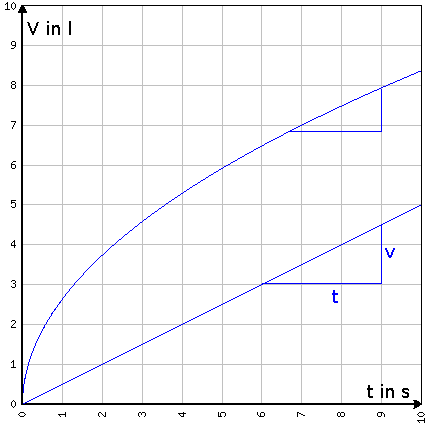
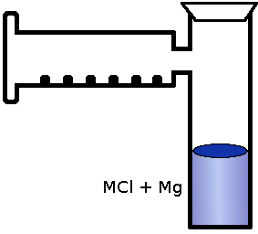
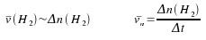
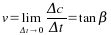
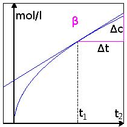

V Einwirkung von Säure (HCl) auf verschiedene Metalle (Fe, Mg) 
B Gasentwicklung

<ul>
    <li>Mg: heftig, kurz </li>
    <li>Fe: eher zögerlich, lang</li>
</ul>

A 2 HCl + Mg &#8594; H2 + MgCl2 
HCl + 2 Fe &#8594; 3 H2 + 2 FeCl3

Bei gleichem &#916;t und jeweiligem &#916;v erhält man eine vom Zeitpunkt abhängige mittlere Geschwindigkeit &#8254;v = &#916;v (H2) / &#916;t. 
Bei gleichem Druck und gleicher Temperatur gilt:

Hier: Heterogene Reaktion, damit alle Fest sind und H3O+-Ionen in flüssiger Phase vorliegen.

Für homogene Reaktionen:

&#8254;v = &#916;c / &#916;t Konzentration in mol / l

Mg + HCl reagieren

a) Reaktionsgleichung + Ionengleichung: 
Mg + 2 HCl &#8594; H2 + MgCl2 
Mn + 2 HCl &#8594; H2 + MnCl2 
mittlere Reaktionsgeschwindigkeit: &#8254;v = &#916;c / &#916;t 
momentane Reaktionsgeschwindigkeit:  
Zu jedem Zeitpunkt t kann eine Geschwindigkeit v(t) angegeben werden, die nicht von der willkürlichen Größe eines Zeitintervalles abhängt.

Weiter mit den <a href="reaktionsgeschwindigkeit.htm">Einflussgrößen auf die Reaktionsgeschwindigkeit</a>

