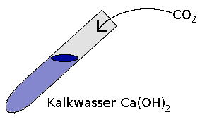
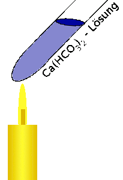
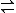
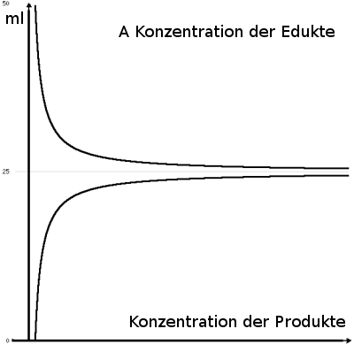

13.12.2007

V1

Ca(OH)2 + CO2 &#8594; CaCO3 + H2O

V2 CO2 wird weiter eingeleitet

CaCO3 + CO2 + H2O &#8594; Ca(HCO3)2

V3

Ca(HCO3) (&#916;T) &#8594; CaCO3 + CO2 + H2O

Zusammenfassung:

 CaCO3 + CO2 + H2O  Ca(HCO3)2

Hin- und Rückreaktion einer umkehrbaren Reaktion führen in einem geschlossenem System zu einem Gemisch aller an der Reaktion beteiligten Stoffe.

<ul>
    <li>Höhlenbildung (Stalagniten und Stalagtiten) 
CO2 + H2O &#8594; H2CO3 &#8594; H+ + HCO3-</li>
</ul>

<h2>Das dynamische Gleichgewicht</h2>

17.12.2007

V Modellversuch zum dynamischen Gleichgewicht 
Volles Gefäß // Leeres &#8594; Pipette 
Lim = V / 2

V0 = 0 ml; AG = 10 
V1 = 100 ml; AG = 10 
V0 = +10 ml - 1 ml 
V1 = 100 - 10 ml + 1 ml 
a + b  c + d

