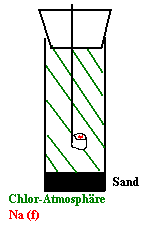
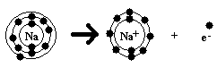
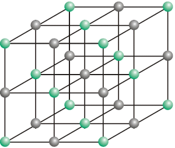

<dl><dd>Salze bestehen aus Metall und Nichtmetall</dd></dl>

z.B.KochsalzNaCl 
KaliumnitratKNO3 
KaliumphosphatK3PO4 
CalciumfluridCaF2 
Eisen(II)-chloridFeCl2 
KaliumjoditKI

<h2>1. Darstellung von Salzen am Beispiel "Kochsalz"</h2>

V:

B:

<ul>
    <li>Reaktion (exotherm)</li>
    <li>Bildung eines weißen Feststoffes, der als Rauch auftritt.</li>
</ul>

E:

<ul>
    <li>exotherme Reaktion</li>
    <li>energetisch Begünstigt</li>
    <li>es entsteht NaCl</li>
    <li>2 Na + Cl2 &#8594; 2 NaCl 
&#916;H &lt; 0</li>
</ul>

Zusammenfassung:

Na &#8594; Na+ + 2 e- |&#8901;2 
Cl2 + 2 e- &#8594; 2 Cl- 
2 Na + Cl2 &#8594; 2 Cl- + 2 Na+ 
2 Na + Cl2 &#8594; 2 NaCl

Bei der Reaktion von NaCl werden die geladenen Teilchen (= Ionen) Na+ und Cl- gebildet. 
Na+: durch Abgabe eines Elektrons aus einem Na-Atom 
Cl-: durch Aufnahme eins Elektrons durch ein Cl-Atom 
Die Triebkraft für die Bildung der Ionen ist das erreichen der Edelgaskonfiguration für die jeweiligen Elemente.

<h2>2. Ionenbindung und Ionengitter</h2>
<dl><dt>Zusammenhalt im NaCl-Kristall</dt><dd>Elektrostatische Anziehungskräfte zwischen den entgegengesetzt geladenen Ionen: Ionenbindung</dd></dl>

Ionengitter aus Na+ und Cl--Ionen &#8658;Struktur des festen NaCl

Im festen Salzkristall nehmen Anionen und Kationen aufgrund der nach allen Seiten wirksamen Kräfte bestimmte Plätze ein. Sie bilden gemeinsam ein sog. Ionengitter.

<h2>3. Eigenschaften von Salzen</h2>
<ul>
    <li>harte Feststoffe</li>
    <li>sehr hoher Schmelzpunkt</li>
    <li>spröde, d.h. brechen bei Krafteinwirkung auseinander &#8594; Verschiebung von Gitter-Ebenen führt zu Abstoßungskräften, wenn gleichnamige Ladungen aufeinander treffen</li>
    <li>Elektrische Leitfähigkeit nicht im Feststoff, aber in der Schmelze &#8594; freie Beweglichkeit der Ionen in der Flüssigkeit&#8658; Ladungsfluss</li>
</ul>

<h2>4. Elektrolyse von Salzen</h2>

 B am + Pol: rotbraune Schlieren 
am - Pol: grauer Überzug 
E am + Pol: elementares Iod 
am - Pol: elementares Zink 
Wanderung der Ionen zu dem entgegengesetzten Elektroden 
&#8594; "Entladung"

Elektrodenreaktionen: 
Kathode (- Pol): 2e- + Zn2+ &#8594; Zn 
Anode (+ Pol): 2I-&#8594; I2 + 2e- 
Gesamtvorgang: Zn2+ + 2I- &#8594; Zu + I2

<h2>5. Molekülionen (Zusammengesetze Ionen)</h2>

(= Ionen, die aus mindestens zwei verschiedenen Elementen bestehen, tragen eine Gesamtladung)

Beispiel: 
N03- Nitrat-Ion (Anion) 
NH4+ Ammonium-Ion (Kation) 
Ca3(PO4)2 Kalziumphosphat 
KMnO4 Kaliumpermanganat

<h2>6. Salzbildung</h2>

Metall &#8594; Metallion (positiv geladen: Kation) 
M &#8594; M+ + e- 
z.B. Na &#8594; Na+ + e-

Nichtmetall &#8594; Nichtmetallion (negativ geladen: Anion) 
e- + X &#8594; X- 
2 e- + Cl2 &#8594; 2 Cl-

<h3>Kristallbildung von Salzen</h3>

Was hält die Bestandteile eines Salzes zusammen? (Metallion - Nichtmetallion)

 Quellen: 
Ionengitter: Computer-Chemie-Centrum, <a href="http://www2.chemie.uni-erlangen.de/projects/vsc/chemie-mediziner-neu/bindung/ionengitter.html">Uni-Erlangen.de</a>

