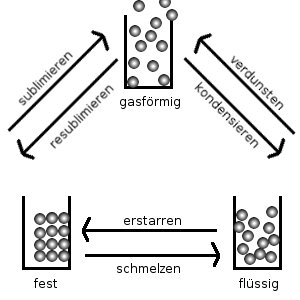
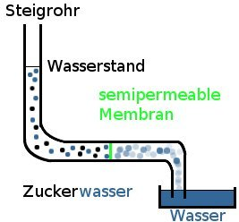

<cite>~ 460 v. Chr.: Demokrit</cite><blockquote class="style1">

Alle Stoffe bestehen aus kleinsten (unteilbaren) Teilchen: Atome

</blockquote>

Besteht ein Teilchen aus mehr als einem Atom, so bezeichnet man es als Molekül.

Besteht ein Stoff aus verschiedenen Atomen, so bezeichnet man es als Verbindung.

Ein Element besteht aus lauter gleichen Atomen.

<h2>Die Aggregatszustände</h2>
<h3>Eigenschaften der Aggregatszustände</h3>

V Man sprüht etwas Parfüm in eine Ecke des Raumes 
B Man kann es nach und nach im ganzen Raum riechen. 
E Alle Teilchen bewegen sich (Brown'sche Molekülbewegung). Somit bewegen sich die Gase von hoher zu niedriger Konzentration (<b>Diffusion</b>)

V Eine Luftgefüllte Spritze wird zugehalten und kräftig zusammengepresst. 
B Die Spritze lässt sich etwas zusammendrücken. 
E Gase lassen sich zusammenpressen, sie sind komprimirbar. Gase haben keine feste Form und kein beständiges Volumen

V Eine mit Wasser gefüllte Spritze wird zugehalten und kräftig zusammengepresst. 
B Die Spritze lässt sich nicht zusammendrücken. 
E Flüssigkeiten sind nicht komprimierbar. Sie haben keine feste Form, jedoch ein beständiges Volumen.

Feststoffe haben ein bestimmtes Volumen und eine feste Form

V Osmose

semipermeabel: halbdurchlässig, durchlässig für Wasser-Teilchen, undurchlässig für Zucker-Teilchen

B Der Zuckerwasserstand steigt im Steigrohr an. 
E Im Zuckerwasser ist die Konzentration der Wasserteilchen geringer als im reinen Wasser. Auch Flüssigkeiten bewegen sich von hoher zu niedriger Konzentration.

<h2>Material</h2>
<ul>
    <li><a href="http://www.youtube.com/watch?v=s-KvoVzukHo">Video der Teilchenstruktur der Materie</a></li>
    <li><a href="doc/teilchenstruktur.pdf">Teilchenstruktur der Materie</a></li>
</ul>
