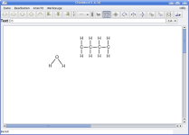
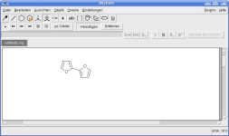
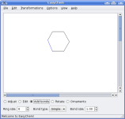
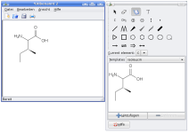
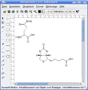

<h2>Bewertungskriterien</h2>

Um die folgenden Programme richtig bewerten zu können werde ich mit jeden dieser Programme versuchen ein <a href="http://upload.wikimedia.org/wikipedia/commons/0/06/DL-Glucose.svg">Traubenzuckermolekül</a> zu zeichnen. Dann werden die Programme unter folgenden Aspekten bewertet:

<ul>
    <li>Exportmöglichkeiten (PNG, JPG, SVG) - Ist die Auflösung hoch?</li>
    <li>Intuitive Bedienung: kann man das Programm nutzen ohne die Bedienung zu lesen?</li>
    <li>GUI: Ist das Interface gut Strukturiert?</li>
    <li>Strukturen: Kann man verschiedene Bindungstypen darstellen?</li>
    <li>Importmöglichkeiten: kann man die Dateien als mol, cdx, pdb, ... exportieren?</li>
    <li>Templates: Sind bestimmte Strukturen schon vorgefertigt?</li>
</ul>

<h2>Tools für Ubuntu</h2>
<h3>ChemTool 1.6.10</h3>
<h4>Installation</h4>

sudo apt-get install chemtool

<h4>Bedienung</h4>

Mit ChemTool lassen sich leicht chemische Strukturen zeichnen. Was mir hier jedoch fehlt ist ein funktionierender Export ins JPG / PNG - Format und eine Möglichkeit freie Elektronenpaare zu zeichnen. 
<a href="http://ruby.chemie.uni-freiburg.de/~martin/chemtool/chemtool.html">ChemTool - offizielle Website</a>

<h3>BKChem 0.12.0</h3>

sudo apt-get install bkchem

<a href="http://bkchem.zirael.org/index.html">BKChem - offizielle Website</a>

<h3>EasyChem 0.6</h3>

sudo apt-get install easychem

<a href="http://easychem.sourceforge.net/">EasyChem - offizielle Website</a>

<h3>GChemPaint 0.8.7</h3>

sudo apt-get install gchempaint

<a href="http://www.nongnu.org/gchempaint/">GChemPaint - offizielle Website</a>

<h3>JChemPaint 2.0</h3>

<a href="http://almost.cubic.uni-koeln.de/cdk/jcp">JChemPaint - offizielle Website</a>

<h3>XDrawChem 1.9.9</h3>

sudo apt-get install xdrawchem

<a href="http://xdrawchem.sourceforge.net/">XDrawChem - offizielle Website</a>

<h2>Tools für Windows</h2>
<ul>
    <li>ChemDraw: Zeichnen von 2D-Strukturen</li>
    <li>ISIS/Draw: Soll leichter zu bedienen sein als ChemDraw</li>
</ul>

